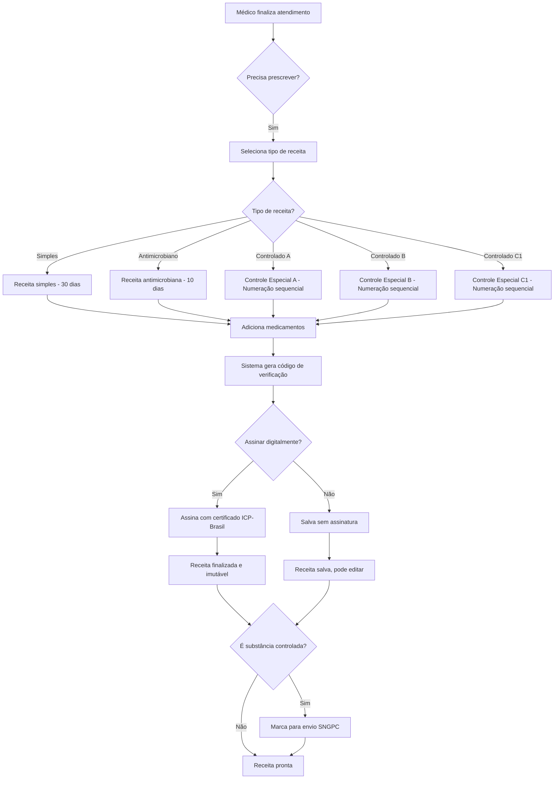

# 💊 Sistema de Receitas Médicas Digitais - MedicWarehouse

> **Status:** ✅ Implementado (Janeiro 2026)  
> **Conformidade:** CFM 1.643/2002 + ANVISA Portaria 344/1998  
> **Versão:** 1.0

---

## 📋 Índice

1. [Visão Geral](#-visão-geral)
2. [Conformidade Regulatória](#-conformidade-regulatória)
3. [Funcionalidades](#-funcionalidades)
4. [Tipos de Receitas](#-tipos-de-receitas)
5. [Substâncias Controladas](#-substâncias-controladas-anvisa-3441998)
6. [Estrutura de Dados](#-estrutura-de-dados)
7. [Fluxo de Uso](#-fluxo-de-uso)
8. [Segurança e Validade](#-segurança-e-validade)
9. [API Endpoints](#-api-endpoints)
10. [Guia de Implementação Frontend](#-guia-de-implementação-frontend)

---

## 🎯 Visão Geral

O **Sistema de Receitas Médicas Digitais** do MedicWarehouse é uma solução completa e conforme as regulamentações brasileiras para prescrição eletrônica de medicamentos. O sistema garante:

- ✅ **Conformidade Legal**: 100% aderente às resoluções CFM 1.643/2002 e ANVISA 344/1998
- ✅ **Segurança**: Assinatura digital, rastreabilidade e controle de acesso
- ✅ **Controle ANVISA**: Rastreamento de substâncias controladas e integração SNGPC
- ✅ **Validade**: Gestão automática de prazos de validade por tipo de medicamento
- ✅ **Rastreabilidade**: Código de verificação único (QR Code) para cada receita
- ✅ **Multi-tenant**: Isolamento completo de dados por clínica

---

## 📜 Conformidade Regulatória

### CFM 1.643/2002 - Receituário Eletrônico

O sistema está em conformidade com a **Resolução CFM 1.643/2002**, que define critérios para digitalização de prontuários e prescrições médicas:

#### Requisitos Implementados:

- ✅ **Identificação do Médico**: Nome completo, CRM e UF
- ✅ **Identificação do Paciente**: Nome completo e documento (CPF/RG)
- ✅ **Data de Emissão**: Timestamp UTC com precisão
- ✅ **Assinatura Digital**: Suporte para certificado ICP-Brasil (pronto para uso)
- ✅ **Código de Verificação**: QR Code único para cada receita
- ✅ **Dados do Medicamento**: Nome, dosagem, forma farmacêutica, frequência, duração
- ✅ **Instruções de Uso**: Campo livre para orientações ao paciente
- ✅ **Integridade**: Receitas assinadas não podem ser modificadas
- ✅ **Retenção**: Sistema mantém receitas por 20 anos (soft delete)

### ANVISA Portaria 344/1998 - Substâncias Controladas

O sistema implementa todos os controles exigidos pela **Portaria 344/1998** da ANVISA:

#### Requisitos Implementados:

- ✅ **Classificação de Listas**: A1, A2, A3, B1, B2, C1, C2, C3, C4, C5
- ✅ **Numeração Sequencial**: Para receitas de controle especial (obrigatório ANVISA)
- ✅ **Prazos de Validade Diferenciados**:
  - Antimicrobianos: 10 dias
  - Controle Especial: 30 dias
  - Receita Simples: 30 dias
- ✅ **Rastreamento SNGPC**: Preparado para envio de dados ao Sistema Nacional de Gerenciamento de Produtos Controlados
- ✅ **Identificação de Controlados**: Flag automático para medicamentos controlados
- ✅ **Registro ANVISA**: Campo para número de registro do medicamento

---

## ✨ Funcionalidades

### Criação de Receitas

```csharp
// Criar uma nova receita digital
var prescription = new DigitalPrescription(
    medicalRecordId: medicalRecord.Id,
    patientId: patient.Id,
    doctorId: doctor.Id,
    type: PrescriptionType.Simple, // ou SpecialControlA, SpecialControlB, etc.
    doctorName: "Dr. João Silva",
    doctorCRM: "12345",
    doctorCRMState: "SP",
    patientName: "Maria Santos",
    patientDocument: "123.456.789-00",
    tenantId: "clinic-001",
    sequenceNumber: "2026/001", // Obrigatório para receitas controladas
    notes: "Tomar após as refeições"
);
```

### Adicionar Medicamentos

```csharp
// Adicionar item à receita
var item = new DigitalPrescriptionItem(
    digitalPrescriptionId: prescription.Id,
    medicationId: medication.Id,
    medicationName: "Paracetamol 500mg",
    dosage: "500mg",
    pharmaceuticalForm: "Comprimido",
    frequency: "8 em 8 horas",
    durationDays: 7,
    quantity: 21, // 7 dias x 3 doses/dia
    tenantId: "clinic-001",
    genericName: "Paracetamol",
    activeIngredient: "Paracetamol",
    isControlledSubstance: false,
    administrationRoute: "Via oral",
    instructions: "Tomar após as refeições com água"
);

prescription.AddItem(item);
```

### Assinatura Digital

```csharp
// Assinar receita digitalmente (ICP-Brasil)
prescription.SignPrescription(
    digitalSignature: "BASE64_SIGNATURE_DATA",
    certificateThumbprint: "CERT_THUMBPRINT"
);

// Após assinada, a receita não pode mais ser modificada
```

### Rastreamento SNGPC

```csharp
// Para substâncias controladas (A, B, C1)
if (prescription.RequiresSNGPCReport)
{
    // Enviar dados para SNGPC
    await SendToSNGPC(prescription);
    
    // Marcar como reportado
    prescription.MarkAsReportedToSNGPC();
}
```

---

## 📝 Tipos de Receitas

O sistema suporta 5 tipos de receitas conforme regulamentação:

### 1. Receita Simples (Simple)
- **Uso:** Medicamentos comuns, sem controle especial
- **Validade:** 30 dias
- **Retenção:** Não obrigatória
- **Exemplos:** Paracetamol, Dipirona, Omeprazol, Losartana

### 2. Receita de Controle Especial B (SpecialControlB)
- **Uso:** Psicotrópicos (Listas B1 e B2 - Portaria 344/98)
- **Validade:** 30 dias
- **Retenção:** Obrigatória (farmácia retém a receita)
- **Numeração:** Sequencial obrigatória
- **SNGPC:** Envio obrigatório
- **Exemplos:** 
  - B1: Benzodiazepínicos (Diazepam, Alprazolam, Clonazepam)
  - B2: Anfetaminas (Metilfenidato, Femproporex)

### 3. Receita de Controle Especial A (SpecialControlA)
- **Uso:** Entorpecentes e psicotrópicos (Listas A1, A2, A3)
- **Validade:** 30 dias
- **Retenção:** Obrigatória (2 vias - uma fica na farmácia)
- **Numeração:** Sequencial obrigatória
- **SNGPC:** Envio obrigatório
- **Cor:** Amarela (padrão ANVISA)
- **Exemplos:**
  - A1: Morfina, Codeína, Metadona, Oxicodona
  - A2: Anfetaminas
  - A3: LSD, Ecstasy (uso controlado)

### 4. Receita Antimicrobiana (Antimicrobial)
- **Uso:** Antibióticos e antimicrobianos
- **Validade:** 10 dias (prazo menor!)
- **Retenção:** Obrigatória desde RDC 20/2011
- **Cor:** Branca (2 vias)
- **Exemplos:** Amoxicilina, Azitromicina, Ciprofloxacino, Cefalexina

### 5. Receita de Controle Especial C1 (SpecialControlC1)
- **Uso:** Outras substâncias controladas
- **Validade:** 30 dias
- **Retenção:** Obrigatória
- **Numeração:** Sequencial obrigatória
- **SNGPC:** Envio obrigatório
- **Exemplos:** 
  - Anticonvulsivantes (Fenitoína, Fenobarbital, Ácido Valproico)
  - Imunossupressores (Talidomida)

---

## 🔬 Substâncias Controladas (ANVISA 344/1998)

O sistema classifica medicamentos conforme as listas da Portaria 344/98:

| Lista | Descrição | Tipo de Receita | SNGPC |
|-------|-----------|-----------------|-------|
| **A1** | Entorpecentes (narcóticos) | Controle Especial A | ✅ Sim |
| **A2** | Entorpecentes (psicotrópicos) | Controle Especial A | ✅ Sim |
| **A3** | Psicotrópicos | Controle Especial A | ✅ Sim |
| **B1** | Psicotrópicos | Controle Especial B | ✅ Sim |
| **B2** | Psicotrópicos anorexígenos | Controle Especial B | ✅ Sim |
| **C1** | Outras substâncias controladas | Controle Especial C1 | ✅ Sim |
| **C2** | Retinóides (uso sistêmico) | Receita de Controle Especial | ✅ Sim |
| **C3** | Imunossupressores | Receita de Controle Especial | ✅ Sim |
| **C4** | Antirretrovirais | Receita de Controle Especial | ✅ Sim |
| **C5** | Anabolizantes | Receita de Controle Especial | ✅ Sim |

### Enum de Classificação

```csharp
public enum ControlledSubstanceList
{
    None = 0,                    // Não controlado
    A1_Narcotics = 1,           // Lista A1 - Narcóticos
    A2_Psychotropics = 2,       // Lista A2 - Psicotrópicos
    A3_Psychotropics = 3,       // Lista A3 - Psicotrópicos
    B1_Psychotropics = 4,       // Lista B1 - Psicotrópicos
    B2_Anorexigenics = 5,       // Lista B2 - Anorexígenos
    C1_OtherControlled = 6,     // Lista C1 - Outros controlados
    C2_Retinoids = 7,           // Lista C2 - Retinóides
    C3_Immunosuppressants = 8,  // Lista C3 - Imunossupressores
    C4_Antiretrovirals = 9,     // Lista C4 - Antirretrovirais
    C5_Anabolics = 10           // Lista C5 - Anabolizantes
}
```

---

## 🗄️ Estrutura de Dados

### Entidade: DigitalPrescription

Campos principais da receita digital:

| Campo | Tipo | Descrição | Obrigatório |
|-------|------|-----------|-------------|
| `Id` | Guid | Identificador único | ✅ |
| `MedicalRecordId` | Guid | Prontuário médico vinculado | ✅ |
| `PatientId` | Guid | ID do paciente | ✅ |
| `DoctorId` | Guid | ID do médico prescritor | ✅ |
| `Type` | PrescriptionType | Tipo de receita | ✅ |
| `SequenceNumber` | string | Numeração sequencial (controlados) | ⚠️ Controlados |
| `IssuedAt` | DateTime | Data/hora de emissão | ✅ |
| `ExpiresAt` | DateTime | Data de expiração | ✅ |
| `IsActive` | bool | Receita ativa? | ✅ |
| `DoctorName` | string | Nome completo do médico | ✅ CFM |
| `DoctorCRM` | string | Número do CRM | ✅ CFM |
| `DoctorCRMState` | string | UF do CRM | ✅ CFM |
| `PatientName` | string | Nome do paciente | ✅ CFM |
| `PatientDocument` | string | CPF ou RG | ✅ CFM |
| `DigitalSignature` | string | Assinatura digital (ICP-Brasil) | ⚪ Opcional |
| `SignedAt` | DateTime | Data/hora da assinatura | ⚪ Se assinada |
| `SignatureCertificate` | string | Thumbprint do certificado | ⚪ Se assinada |
| `VerificationCode` | string | Código QR único | ✅ |
| `RequiresSNGPCReport` | bool | Requer envio ao SNGPC? | ✅ |
| `ReportedToSNGPCAt` | DateTime | Data de envio ao SNGPC | ⚪ Se reportado |
| `Notes` | string | Observações gerais | ⚪ Opcional |
| `TenantId` | string | Identificador da clínica | ✅ |

### Entidade: DigitalPrescriptionItem

Campos dos itens (medicamentos) da receita:

| Campo | Tipo | Descrição | Obrigatório |
|-------|------|-----------|-------------|
| `Id` | Guid | Identificador único | ✅ |
| `DigitalPrescriptionId` | Guid | ID da receita | ✅ |
| `MedicationId` | Guid | ID do medicamento | ✅ |
| `MedicationName` | string | Nome do medicamento | ✅ |
| `GenericName` | string | Nome genérico (DCB/DCI) | ⚪ Recomendado |
| `ActiveIngredient` | string | Princípio ativo | ⚪ Recomendado |
| `IsControlledSubstance` | bool | É controlado? | ✅ |
| `ControlledList` | enum | Lista ANVISA (A1, B1, C1...) | ⚠️ Se controlado |
| `AnvisaRegistration` | string | Nº registro ANVISA | ⚪ Recomendado |
| `Dosage` | string | Dosagem (ex: "500mg") | ✅ CFM |
| `PharmaceuticalForm` | string | Forma (ex: "Comprimido") | ✅ CFM |
| `Frequency` | string | Frequência (ex: "8/8h") | ✅ CFM |
| `DurationDays` | int | Duração em dias | ✅ CFM |
| `Quantity` | int | Quantidade total | ✅ CFM |
| `AdministrationRoute` | string | Via de administração | ⚪ Recomendado |
| `Instructions` | string | Instruções especiais | ⚪ Recomendado |
| `BatchNumber` | string | Lote (rastreamento) | ⚪ SNGPC |
| `ManufactureDate` | DateTime | Data de fabricação | ⚪ SNGPC |
| `ExpiryDate` | DateTime | Data de validade | ⚪ SNGPC |

---

## 🔄 Fluxo de Uso

### 1. Atendimento Médico

```
Médico → Atende Paciente → Cria Prontuário → Prescreve Medicamentos
```

### 2. Criação da Receita



### 3. Entrega ao Paciente

```
Sistema → Gera PDF/Impressão → Código QR → Paciente recebe
```

### 4. Validação na Farmácia

```
Farmácia → Lê QR Code → Verifica autenticidade → Dispensa medicamento
```

### 5. Rastreamento SNGPC (Controlados)

```
Sistema → Envia dados ao SNGPC → ANVISA registra → Compliance completo
```

---

## 🔒 Segurança e Validade

### Validação de Receitas

O sistema valida automaticamente:

```csharp
// Verificar se receita está válida
bool isValid = prescription.IsValid();
// Retorna true se: IsActive = true, não expirada, tem medicamentos

// Verificar expiração
bool isExpired = prescription.IsExpired();
// Retorna true se DateTime.UtcNow > ExpiresAt

// Dias até expirar
int daysLeft = prescription.DaysUntilExpiration();
```

### Regras de Segurança

1. **Imutabilidade**: Receitas assinadas não podem ser modificadas
2. **Isolamento**: Multi-tenant garante que clínicas só acessem suas receitas
3. **Rastreabilidade**: Cada receita tem código único (QR Code)
4. **Auditoria**: Soft delete mantém histórico por 20 anos
5. **Integridade**: Dados do médico e paciente duplicados na receita para garantir integridade

### Código de Verificação

Formato: `TIPO-YYYYMMDD-UNIQUE8`

Exemplo: `01-20260106-A3B5C7D9`

- **TIPO**: Código do tipo de receita (01-05)
- **YYYYMMDD**: Data de emissão
- **UNIQUE8**: 8 caracteres únicos aleatórios

---

## 🔌 API Endpoints

### Criar Receita Digital

```http
POST /api/digital-prescriptions
Authorization: Bearer {token}
Content-Type: application/json

{
  "medicalRecordId": "uuid",
  "patientId": "uuid",
  "doctorId": "uuid",
  "type": 1,
  "sequenceNumber": "2026/001",
  "notes": "Tomar após as refeições",
  "items": [
    {
      "medicationId": "uuid",
      "medicationName": "Paracetamol 500mg",
      "dosage": "500mg",
      "pharmaceuticalForm": "Comprimido",
      "frequency": "8 em 8 horas",
      "durationDays": 7,
      "quantity": 21,
      "administrationRoute": "Via oral",
      "instructions": "Tomar com água"
    }
  ]
}
```

### Listar Receitas do Paciente

```http
GET /api/digital-prescriptions/patient/{patientId}
Authorization: Bearer {token}
```

### Obter Receita por ID

```http
GET /api/digital-prescriptions/{id}
Authorization: Bearer {token}
```

### Assinar Receita

```http
POST /api/digital-prescriptions/{id}/sign
Authorization: Bearer {token}
Content-Type: application/json

{
  "digitalSignature": "BASE64_SIGNATURE",
  "certificateThumbprint": "CERT_THUMBPRINT"
}
```

### Validar Receita (QR Code)

```http
GET /api/digital-prescriptions/verify/{verificationCode}
```

### Marcar como Reportado ao SNGPC

```http
POST /api/digital-prescriptions/{id}/report-sngpc
Authorization: Bearer {token}
```

### Desativar Receita

```http
DELETE /api/digital-prescriptions/{id}
Authorization: Bearer {token}
```

---

## 🎨 Guia de Implementação Frontend

### 1. Formulário de Criação de Receita

**Componente:** `digital-prescription-form.component.ts`

```typescript
interface DigitalPrescriptionForm {
  medicalRecordId: string;
  patientId: string;
  doctorId: string;
  type: PrescriptionType;
  sequenceNumber?: string; // Obrigatório para controlados
  notes?: string;
  items: DigitalPrescriptionItemForm[];
}

interface DigitalPrescriptionItemForm {
  medicationId: string;
  medicationName: string;
  dosage: string;
  pharmaceuticalForm: string;
  frequency: string;
  durationDays: number;
  quantity: number;
  administrationRoute?: string;
  instructions?: string;
}
```

### 2. Seletor de Tipo de Receita

```html
<select formControlName="type">
  <option value="1">Receita Simples (30 dias)</option>
  <option value="4">Receita Antimicrobiana (10 dias)</option>
  <option value="2">Controle Especial B - Psicotrópicos (30 dias)</option>
  <option value="3">Controle Especial A - Entorpecentes (30 dias)</option>
  <option value="5">Controle Especial C1 - Outros (30 dias)</option>
</select>
```

### 3. Alertas Automáticos

```typescript
// Mostrar alerta se for receita controlada
if (this.isControlledPrescription(type)) {
  this.showAlert('Atenção: Receita de controle especial requer numeração sequencial e retenção pela farmácia.');
}

// Mostrar alerta se for antimicrobiano
if (type === PrescriptionType.Antimicrobial) {
  this.showAlert('Atenção: Receita antimicrobiana válida por apenas 10 dias.');
}
```

### 4. Geração de PDF

```typescript
generatePrescriptionPDF(prescription: DigitalPrescription) {
  const doc = new jsPDF();
  
  // Cabeçalho
  doc.text(`RECEITA MÉDICA ${this.getPrescriptionTypeName(prescription.type)}`, 10, 10);
  
  // Dados do médico (CFM obrigatório)
  doc.text(`Dr(a). ${prescription.doctorName}`, 10, 20);
  doc.text(`CRM: ${prescription.doctorCRM} / ${prescription.doctorCRMState}`, 10, 25);
  
  // Dados do paciente
  doc.text(`Paciente: ${prescription.patientName}`, 10, 35);
  doc.text(`Documento: ${prescription.patientDocument}`, 10, 40);
  
  // Data de emissão e validade
  doc.text(`Emitida em: ${formatDate(prescription.issuedAt)}`, 10, 50);
  doc.text(`Válida até: ${formatDate(prescription.expiresAt)}`, 10, 55);
  
  // Medicamentos
  let y = 70;
  prescription.items.forEach((item, index) => {
    doc.text(`${index + 1}. ${item.medicationName}`, 10, y);
    y += 5;
    doc.text(`   Dosagem: ${item.dosage} - ${item.pharmaceuticalForm}`, 10, y);
    y += 5;
    doc.text(`   Frequência: ${item.frequency}`, 10, y);
    y += 5;
    doc.text(`   Duração: ${item.durationDays} dias - Total: ${item.quantity} unidades`, 10, y);
    y += 5;
    if (item.instructions) {
      doc.text(`   Instruções: ${item.instructions}`, 10, y);
      y += 5;
    }
    y += 5;
  });
  
  // QR Code (código de verificação)
  this.generateQRCode(prescription.verificationCode, (qrImage) => {
    doc.addImage(qrImage, 'PNG', 150, 250, 50, 50);
    doc.text('Código de verificação:', 140, 245);
    doc.text(prescription.verificationCode, 135, 305);
    
    // Salvar PDF
    doc.save(`receita-${prescription.id}.pdf`);
  });
}
```

### 5. Visualização de Receita

```html
<div class="prescription-view">
  <div class="header">
    <h2>{{ getPrescriptionTypeName(prescription.type) }}</h2>
    <span class="status" [class.expired]="prescription.isExpired">
      {{ prescription.isExpired ? 'EXPIRADA' : 'VÁLIDA' }}
    </span>
  </div>
  
  <div class="doctor-info">
    <h3>Médico Prescritor</h3>
    <p>{{ prescription.doctorName }}</p>
    <p>CRM: {{ prescription.doctorCRM }} / {{ prescription.doctorCRMState }}</p>
  </div>
  
  <div class="patient-info">
    <h3>Paciente</h3>
    <p>{{ prescription.patientName }}</p>
    <p>Documento: {{ prescription.patientDocument }}</p>
  </div>
  
  <div class="validity">
    <p>Emitida em: {{ prescription.issuedAt | date:'dd/MM/yyyy HH:mm' }}</p>
    <p>Válida até: {{ prescription.expiresAt | date:'dd/MM/yyyy' }}</p>
    <p *ngIf="!prescription.isExpired">
      Expira em {{ prescription.daysUntilExpiration }} dias
    </p>
  </div>
  
  <div class="medications">
    <h3>Medicamentos Prescritos</h3>
    <div *ngFor="let item of prescription.items; let i = index" class="medication-item">
      <h4>{{ i + 1 }}. {{ item.medicationName }}</h4>
      <p><strong>Dosagem:</strong> {{ item.dosage }} - {{ item.pharmaceuticalForm }}</p>
      <p><strong>Frequência:</strong> {{ item.frequency }}</p>
      <p><strong>Duração:</strong> {{ item.durationDays }} dias</p>
      <p><strong>Quantidade Total:</strong> {{ item.quantity }} unidades</p>
      <p *ngIf="item.administrationRoute">
        <strong>Via:</strong> {{ item.administrationRoute }}
      </p>
      <p *ngIf="item.instructions">
        <strong>Instruções:</strong> {{ item.instructions }}
      </p>
      <span *ngIf="item.isControlledSubstance" class="badge controlled">
        CONTROLADO - Lista {{ getControlledListName(item.controlledList) }}
      </span>
    </div>
  </div>
  
  <div class="qr-code">
    <qrcode [qrdata]="prescription.verificationCode" [width]="200"></qrcode>
    <p>Código: {{ prescription.verificationCode }}</p>
  </div>
  
  <div class="signature" *ngIf="prescription.digitalSignature">
    <p>✓ Assinado digitalmente em {{ prescription.signedAt | date:'dd/MM/yyyy HH:mm' }}</p>
    <p>Certificado: {{ prescription.signatureCertificate }}</p>
  </div>
</div>
```

---

## 📊 Estatísticas e Métricas

O sistema pode gerar relatórios sobre prescrições:

- Total de receitas emitidas por período
- Receitas por tipo (Simples, Controladas, Antimicrobianas)
- Medicamentos mais prescritos
- Receitas expiradas vs. ativas
- Compliance SNGPC (receitas reportadas)
- Tempo médio de validade restante

---

## 🚀 Próximos Passos

### Implementações Futuras:

1. **API Controller**: Criar endpoints REST para frontend
2. **Integração SNGPC**: Envio automático para ANVISA
3. **Assinatura ICP-Brasil**: Integração com certificados digitais
4. **Impressão Automática**: Templates PDF prontos
5. **Frontend Angular**: Componentes completos de UI
6. **Notificações**: Alertas de receitas próximas do vencimento
7. **Relatórios**: Dashboard com métricas de prescrições

---

## 📚 Referências

- [Resolução CFM 1.643/2002](http://www.portalmedico.org.br/resolucoes/cfm/2002/1643_2002.htm) - Prontuário Eletrônico
- [Portaria ANVISA 344/1998](https://bvsms.saude.gov.br/bvs/saudelegis/svs/1998/prt0344_12_05_1998_rep.html) - Substâncias Controladas
- [RDC ANVISA 20/2011](https://bvsms.saude.gov.br/bvs/saudelegis/anvisa/2011/rdc0020_05_05_2011.html) - Receitas Antimicrobianas
- [SNGPC - Sistema Nacional de Gerenciamento de Produtos Controlados](https://www.gov.br/anvisa/pt-br/assuntos/fiscalizacao-e-monitoramento/sngpc)

---

## 📞 Suporte

Para dúvidas sobre implementação ou uso do sistema:

- **Documentação Técnica**: [API_DOCUMENTATION.md](./DIGITAL_PRESCRIPTIONS_API.md)
- **Guia do Médico**: [DIGITAL_PRESCRIPTIONS_USAGE_GUIDE.md](./DIGITAL_PRESCRIPTIONS_USAGE_GUIDE.md)
- **Compliance**: [DIGITAL_PRESCRIPTIONS_COMPLIANCE.md](./DIGITAL_PRESCRIPTIONS_COMPLIANCE.md)
- **Email**: suporte@medicwarehouse.com

---

**Última Atualização:** Janeiro 2026  
**Versão da Documentação:** 1.0  
**Status:** ✅ Implementado e Pronto para Uso
