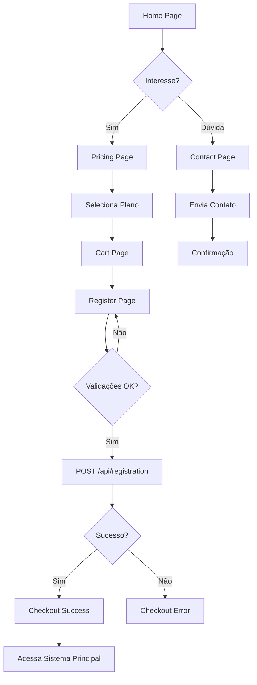
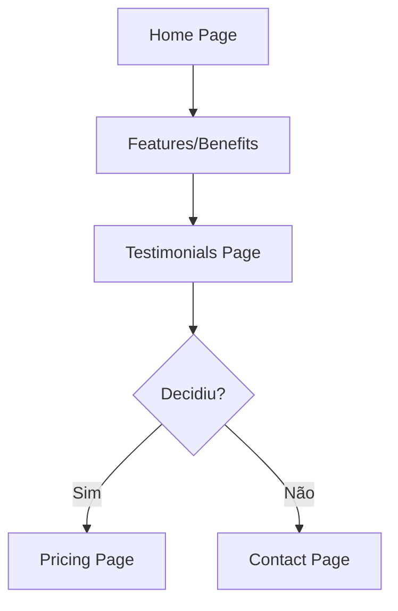

# MW.Site - Marketing and SaaS Subscription Website

## Visão Geral

MW.Site é o site de marketing e contratação do PrimeCare Software SaaS. Desenvolvido em Angular 20, oferece uma experiência completa para visitantes conhecerem o produto, visualizarem planos e realizarem o cadastro com período de teste gratuito de 15 dias.

## 🎯 Objetivos

- Apresentar os serviços e diferenciais do PrimeCare Software
- Facilitar a contratação de planos de assinatura
- Proporcionar período de teste gratuito de 15 dias
- Integrar com sistema de pagamentos
- Capturar leads através de formulário de contato
- Oferecer múltiplos canais de comunicação (WhatsApp, Email, Telefone)

## 📱 Páginas Implementadas

### 1. Home Page (`/`)
**Objetivo**: Apresentar o produto e capturar interesse

**Seções**:
- Hero com call-to-action para teste gratuito
- Features (6 cards com principais funcionalidades)
- Benefícios e diferenciais
- Como funciona (3 passos)
- CTA final com botões para cadastro e WhatsApp

**Componentes**:
- `HomeComponent`
- Template: `home.html`
- Estilos: `home.scss`

### 2. Pricing (`/pricing`)
**Objetivo**: Apresentar os planos disponíveis

**Planos Disponíveis**:
- **Básico**: R$ 190/mês - 2 usuários, 100 pacientes
- **Médio** (Recomendado): R$ 240/mês - 3 usuários, 300 pacientes
- **Premium**: R$ 320/mês - 5 usuários, pacientes ilimitados
- **Personalizado**: Sob consulta - Recursos customizados

**Features**:
- Card destacado para plano recomendado
- Lista detalhada de recursos por plano
- FAQ com perguntas frequentes
- Botão direto para cadastro ou contato (personalizado)

**Componentes**:
- `PricingComponent`
- `SubscriptionService` (fornece dados dos planos)
- Template: `pricing.html`
- Estilos: `pricing.scss`

### 3. Contact (`/contact`)
**Objetivo**: Capturar leads e dúvidas

**Funcionalidades**:
- Formulário de contato com validação
- Informações de contato (email, telefone, WhatsApp)
- Integração com WhatsApp (botão direto)
- Horário de atendimento
- Feedback de sucesso/erro no envio

**Campos do Formulário**:
- Nome completo
- Email
- Telefone
- Assunto
- Mensagem

**API Endpoint**: `POST /api/contact`

**Componentes**:
- `ContactComponent`
- Template: `contact.html`
- Estilos: `contact.scss`

### 4. Testimonials (`/testimonials`)
**Objetivo**: Construir confiança através de depoimentos

**Funcionalidades**:
- Cards de depoimentos com foto/avatar
- Rating com estrelas
- Nome, cargo e clínica do depoente
- CTA para cadastro ao final

**Componentes**:
- `TestimonialsComponent`
- Model: `Testimonial`
- Template: `testimonials.html`
- Estilos: `testimonials.scss`

### 5. Register (`/register`)
**Objetivo**: Cadastro completo de nova clínica

**Wizard de 5 Etapas**:
1. **Informações da Clínica**: Nome, CNPJ, telefone, email
2. **Endereço**: CEP, rua, número, complemento, bairro, cidade, estado
3. **Dados do Responsável**: Nome, CPF, telefone, email
4. **Criar Acesso**: Username, senha, confirmar senha
5. **Confirmar**: Revisão de todos os dados + aceite de termos

**Validações**:
- Formato de CNPJ (00.000.000/0000-00)
- Formato de CPF (000.000.000-00)
- Formato de CEP (00000-000)
- Senha com mínimo de 8 caracteres
- Confirmação de senha
- Aceite obrigatório dos termos

**API Endpoint**: `POST /api/registration`

**Query Params**: `?plan=basic-plan` (quando vindo da página de planos)

**Componentes**:
- `RegisterComponent`
- Model: `RegistrationRequest`
- Template: `register.html`
- Estilos: `register.scss`

### 6. Cart (`/cart`)
**Objetivo**: Visualizar plano selecionado antes de finalizar

**Funcionalidades**:
- Exibir plano adicionado ao carrinho
- Resumo financeiro
- Informação sobre período de teste
- Botão para prosseguir para cadastro
- Persistência em localStorage

**Componentes**:
- `CartComponent`
- `CartService` (gerencia estado do carrinho)
- Template: `cart.html`
- Estilos: `cart.scss`

### 7. Checkout (`/checkout`)
**Objetivo**: Confirmação e próximos passos após cadastro

**Versões**:
- **Sucesso**: Mostra confirmação, ID da clínica, próximos passos
- **Erro**: Mensagem de erro com opção de tentar novamente

**Informações Exibidas no Sucesso**:
- Confirmação visual (checkmark)
- Próximos passos (3 cards)
- Informação sobre período de teste
- Botão para acessar o sistema
- Informações de suporte

**Query Params**: `?success=true&clinicId=xxx`

**Componentes**:
- `CheckoutComponent`
- Template: `checkout.html`
- Estilos: `checkout.scss`

## 🏗️ Arquitetura

### Estrutura de Pastas

```
mw-site/
├── src/
│   ├── app/
│   │   ├── components/           # Componentes compartilhados
│   │   │   ├── header/           # Cabeçalho com navegação
│   │   │   └── footer/           # Rodapé com links
│   │   ├── pages/                # Páginas da aplicação
│   │   │   ├── home/
│   │   │   ├── pricing/
│   │   │   ├── contact/
│   │   │   ├── testimonials/
│   │   │   ├── register/
│   │   │   ├── cart/
│   │   │   └── checkout/
│   │   ├── models/               # Modelos de dados
│   │   │   ├── subscription-plan.model.ts
│   │   │   ├── cart-item.model.ts
│   │   │   ├── registration.model.ts
│   │   │   ├── testimonial.model.ts
│   │   │   └── contact.model.ts
│   │   ├── services/             # Serviços
│   │   │   ├── subscription.ts   # API de planos
│   │   │   └── cart.ts           # Gerenciamento do carrinho
│   │   ├── app.routes.ts         # Configuração de rotas
│   │   ├── app.config.ts         # Configuração da aplicação
│   │   └── app.ts                # Componente raiz
│   ├── environments/             # Configurações de ambiente
│   │   ├── environment.ts        # Development
│   │   └── environment.prod.ts   # Production
│   └── styles.scss               # Estilos globais
├── angular.json                  # Configuração do Angular
├── package.json                  # Dependências npm
└── tsconfig.json                 # Configuração TypeScript
```

### Serviços

#### SubscriptionService
**Responsabilidade**: Gerenciar planos e comunicação com API

**Métodos**:
- `getPlans()`: Retorna lista de planos disponíveis
- `getPlanById(id)`: Busca plano específico
- `register(request)`: POST para cadastro de nova clínica
- `sendContactMessage(request)`: POST para envio de formulário de contato
- `checkCNPJ(cnpj)`: Verifica se CNPJ já existe
- `checkUsername(username)`: Verifica disponibilidade de username

#### CartService
**Responsabilidade**: Gerenciar carrinho de compras

**Métodos**:
- `getCart()`: Retorna signal com estado atual do carrinho
- `addToCart(plan)`: Adiciona plano ao carrinho
- `removeFromCart(planId)`: Remove plano do carrinho
- `clearCart()`: Limpa o carrinho
- `getItemCount()`: Retorna quantidade de itens

**Persistência**: localStorage (`mw-cart`)

### Models

#### SubscriptionPlan
```typescript
interface SubscriptionPlan {
  id: string;
  name: string;
  description: string;
  monthlyPrice: number;
  trialDays: number;
  maxUsers: number;
  maxPatients: number;
  hasReports: boolean;
  hasWhatsAppIntegration: boolean;
  hasSMSNotifications: boolean;
  hasTissExport: boolean;
  isActive: boolean;
  type: PlanType;
  features: string[];
  isRecommended?: boolean;
}
```

#### RegistrationRequest
```typescript
interface RegistrationRequest {
  // Clinic
  clinicName: string;
  clinicCNPJ: string;
  clinicPhone: string;
  clinicEmail: string;
  
  // Address
  street: string;
  number: string;
  complement?: string;
  neighborhood: string;
  city: string;
  state: string;
  zipCode: string;
  
  // Owner
  ownerName: string;
  ownerCPF: string;
  ownerPhone: string;
  ownerEmail: string;
  
  // Login
  username: string;
  password: string;
  
  // Subscription
  planId: string;
  acceptTerms: boolean;
  useTrial: boolean;
}
```

## 🎨 Design System

### Cores

```scss
// Primary
$primary: #667eea;
$primary-dark: #5568d3;
$primary-gradient: linear-gradient(135deg, #667eea 0%, #764ba2 100%);

// Secondary
$secondary: #e0e0e0;
$secondary-dark: #d0d0d0;

// Success
$success: #27ae60;
$success-light: #e8f5e9;

// Error
$error: #e74c3c;
$error-light: #f8d7da;

// Text
$text-primary: #2c3e50;
$text-secondary: #7f8c8d;
$text-light: #bdc3c7;

// WhatsApp
$whatsapp: #25D366;
```

### Tipografia

```scss
// Headings
h1: 3rem (mobile: 2rem)
h2: 2.5rem (mobile: 2rem)
h3: 1.5rem

// Body
p: 1rem
small: 0.85rem
```

### Espaçamento

```scss
$spacing-unit: 1rem;
$spacing-xs: 0.5rem;
$spacing-sm: 1rem;
$spacing-md: 1.5rem;
$spacing-lg: 2rem;
$spacing-xl: 3rem;
$spacing-xxl: 4rem;
```

### Breakpoints

```scss
$mobile: 768px;
$tablet: 1024px;
$desktop: 1200px;
```

## 🔌 Integração com Backend

### API Base URL

**Development**: `http://localhost:5000`
**Production**: `https://api.medicwarehouse.com`

Configurado em: `src/environments/environment.ts`

### Endpoints Utilizados

#### 1. Registration
```
POST /api/registration
Content-Type: application/json

Request:
{
  "clinicName": "string",
  "clinicCNPJ": "string",
  "clinicPhone": "string",
  "clinicEmail": "string",
  "street": "string",
  "number": "string",
  "complement": "string",
  "neighborhood": "string",
  "city": "string",
  "state": "string",
  "zipCode": "string",
  "ownerName": "string",
  "ownerCPF": "string",
  "ownerPhone": "string",
  "ownerEmail": "string",
  "username": "string",
  "password": "string",
  "planId": "string",
  "acceptTerms": true,
  "useTrial": true
}

Response:
{
  "success": true,
  "message": "string",
  "clinicId": "guid",
  "userId": "guid",
  "trialEndDate": "datetime"
}
```

#### 2. Check CNPJ
```
GET /api/registration/check-cnpj/{cnpj}

Response:
{
  "exists": boolean
}
```

#### 3. Check Username
```
GET /api/registration/check-username/{username}

Response:
{
  "available": boolean
}
```

#### 4. Contact Form
```
POST /api/contact
Content-Type: application/json

Request:
{
  "name": "string",
  "email": "string",
  "phone": "string",
  "subject": "string",
  "message": "string"
}

Response:
{
  "success": true,
  "message": "string"
}
```

## 🔒 Segurança

### Validações Frontend

1. **CNPJ**: Formato brasileiro (00.000.000/0000-00)
2. **CPF**: Formato brasileiro (000.000.000-00)
3. **Email**: Formato válido de email
4. **Telefone**: Formato brasileiro
5. **Senha**: Mínimo 8 caracteres
6. **Campos obrigatórios**: Validação em tempo real

### Sanitização

- Remoção de espaços em branco desnecessários (trim)
- Prevenção de XSS através de template binding do Angular
- Validação de tipos de dados

### HTTPS

- Todas as chamadas API devem ser feitas via HTTPS em produção
- Configurado no environment.prod.ts

## 🚀 Build e Deploy

### Development

```bash
cd frontend/mw-site
npm install
npm start
```

Acesse: `http://localhost:4200`

### Production Build

```bash
npm run build
```

Arquivos de saída: `dist/mw-site/`

### Deploy

Os arquivos em `dist/` podem ser servidos por:
- Nginx
- Apache
- AWS S3 + CloudFront
- Firebase Hosting
- Vercel
- Netlify

### Exemplo de configuração Nginx

```nginx
server {
    listen 80;
    server_name mw-site.medicwarehouse.com;

    root /var/www/mw-site;
    index index.html;

    location / {
        try_files $uri $uri/ /index.html;
    }

    # Cache static assets
    location ~* \.(js|css|png|jpg|jpeg|gif|ico|svg|woff|woff2|ttf|eot)$ {
        expires 1y;
        add_header Cache-Control "public, immutable";
    }

    # Gzip compression
    gzip on;
    gzip_types text/plain text/css application/json application/javascript text/xml application/xml application/xml+rss text/javascript;
}
```

## 📱 Responsividade

O site é totalmente responsivo e otimizado para:

- **Mobile**: 320px - 768px
- **Tablet**: 768px - 1024px
- **Desktop**: 1024px+

### Breakpoints Utilizados

```scss
@media (max-width: 768px) {
  // Mobile styles
}

@media (min-width: 769px) and (max-width: 1024px) {
  // Tablet styles
}

@media (min-width: 1025px) {
  // Desktop styles
}
```

## 🧪 Testing

### Unit Tests

Executar testes:
```bash
npm test
```

### E2E Tests

Executar testes end-to-end:
```bash
npm run e2e
```

## 📈 Analytics e Tracking

Recomendações para implementar:

1. **Google Analytics**: Rastreamento de páginas e eventos
2. **Facebook Pixel**: Conversões para anúncios
3. **Hotjar**: Mapa de calor e gravações de sessão
4. **Google Tag Manager**: Gerenciamento de tags

### Eventos para Rastrear

- Visualização de planos
- Cliques em "Começar Teste Grátis"
- Submissão de formulário de contato
- Clique em WhatsApp
- Conclusão de cadastro
- Abandono de carrinho

## 🔄 Fluxo do Usuário

### Fluxo Principal (Cadastro com Teste Gratuito)



### Fluxo Secundário (Apenas Informação)



## 📞 Suporte e Contato

- **Email**: contato@medicwarehouse.com
- **Telefone**: (11) 99999-9999
- **WhatsApp**: +55 11 99999-9999
- **Horário**: Segunda a Sexta, 8h às 18h | Sábados, 9h às 13h

## 📝 Notas de Implementação

### Melhorias Futuras

1. **SEO**: Adicionar meta tags, sitemap.xml, robots.txt
2. **PWA**: Transformar em Progressive Web App
3. **Lazy Loading**: Carregar páginas sob demanda
4. **Internacionalização**: Suporte para múltiplos idiomas
5. **Acessibilidade**: Melhorar ARIA labels e navegação por teclado
6. **Chat Online**: Integrar Intercom ou similar
7. **Blog**: Seção de conteúdo educativo
8. **Comparador de Planos**: Tabela side-by-side
9. **Calculadora de ROI**: Ferramenta interativa
10. **Demos ao Vivo**: Agendamento de demonstrações

### Considerações de Performance

- Bundle size atual: ~400KB
- First Contentful Paint target: < 1.5s
- Time to Interactive target: < 3.5s
- Usar lazy loading para imagens
- Implementar service worker para cache

## 📄 Licença

Este projeto está sob a licença MIT. Veja o arquivo LICENSE para mais detalhes.

---

**Desenvolvido com ❤️ pela equipe PrimeCare Software**
