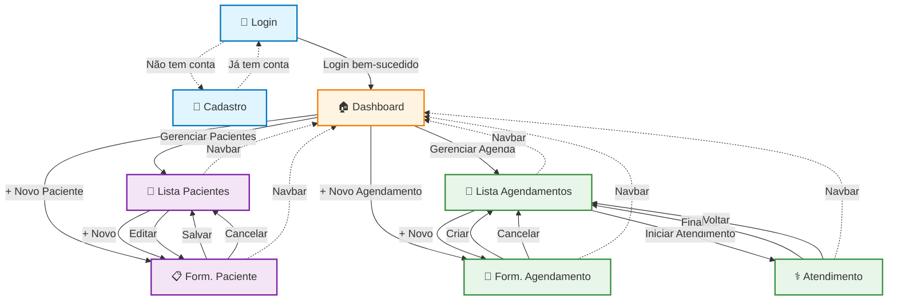
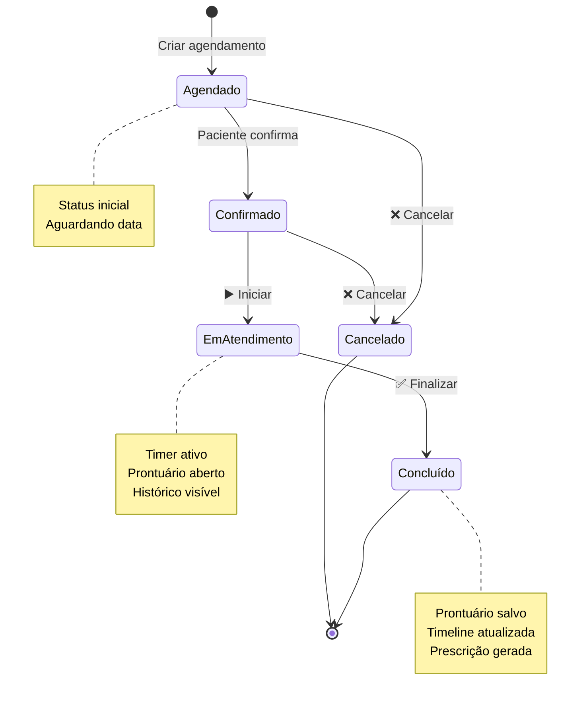
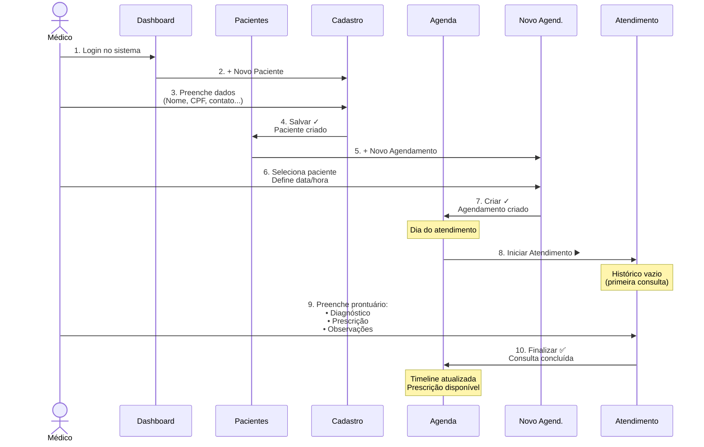
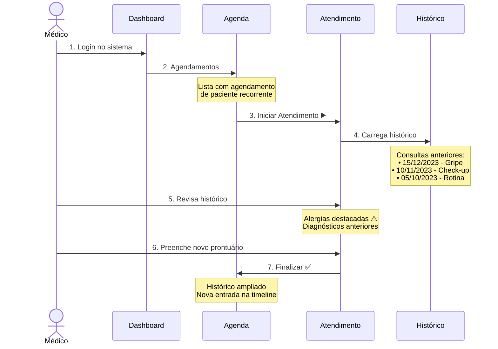
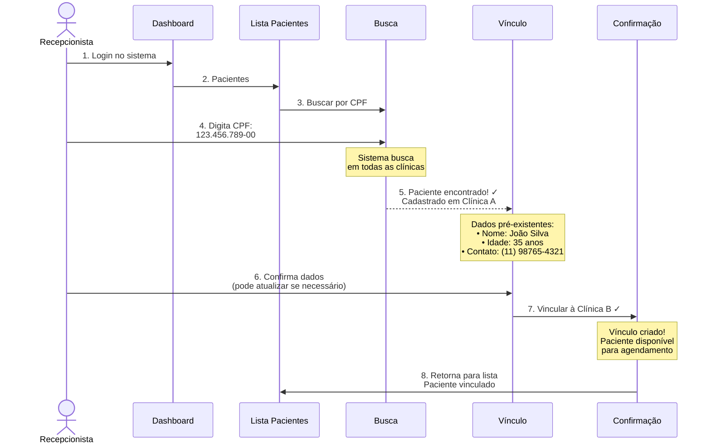

# Resumo Visual dos Fluxos - PrimeCare Software

## 🎯 Visão Geral do Sistema

Este documento apresenta um resumo visual rápido dos principais fluxos do sistema PrimeCare Software.

Para documentação completa, consulte: [SCREENS_DOCUMENTATION.md](../SCREENS_DOCUMENTATION.md)

---

## 🗺️ Mapa de Navegação Completo



---

## 📊 Ciclo de Vida do Atendimento



---

## 🔄 Fluxo 1: Primeiro Atendimento (Paciente Novo)



---

## 🔄 Fluxo 2: Atendimento Recorrente (Paciente Existente)



---

## 🔄 Fluxo 3: Vínculo de Paciente (Outra Clínica)



---

## 📋 Resumo das Telas

| # | Tela | Função Principal | Acesso |
|---|------|------------------|--------|
| 1 | **Login** | Autenticação de usuário | Entrada do sistema |
| 2 | **Cadastro** | Criar nova conta | Link no Login |
| 3 | **Dashboard** | Visão geral e navegação | Após login |
| 4 | **Lista de Pacientes** | Gerenciar pacientes | Dashboard → Pacientes |
| 5 | **Formulário de Paciente** | Criar/editar paciente | Lista ou Dashboard → + Novo |
| 6 | **Lista de Agendamentos** | Visualizar agenda | Dashboard → Agendamentos |
| 7 | **Formulário de Agendamento** | Criar agendamento | Lista ou Dashboard → + Novo |
| 8 | **Atendimento** | Realizar consulta e prontuário | Lista Agendamentos → Iniciar |

---

## 🎨 Componentes Visuais Principais

### Navbar (Presente em todas as telas autenticadas)
```
┌────────────────────────────────────────────┐
│ [🏥 PrimeCare Software] [Dashboard] [Pacientes] │
│ [Agendamentos] [Financeiro] [Sair] 👤      │
└────────────────────────────────────────────┘
```

### Card de Ação Rápida (Dashboard)
```
┌──────────────┐
│   👥 Ícone   │
│              │
│   Título     │
│              │
│  Descrição   │
│   do card    │
└──────────────┘
```

### Item de Timeline (Atendimento)
```
┌─────────────────────────────┐
│ 📅 15/01/2024 14:30         │
│ Consulta Regular (30 min)   │
│ Diagnóstico: Hipertensão    │
│ Prescrição: Losartana 50mg  │
└─────────────────────────────┘
```

### Card de Agendamento (Lista)
```
┌──────────────────────────────────────┐
│ 08:00 │ João Silva                  │
│       │ Consulta - 30min            │
│       │ Status: Agendado            │
│       │ [Iniciar] [Cancelar]        │
└──────────────────────────────────────┘
```

---

## 🚦 Indicadores de Status

- 🟢 **Verde**: Concluído, Ativo, Sucesso
- 🔵 **Azul**: Em Progresso, Informação
- 🟡 **Amarelo**: Aguardando, Aviso
- 🔴 **Vermelho**: Cancelado, Erro
- ⚫ **Cinza**: Inativo, Desabilitado

---

## 📱 Ações Disponíveis por Tela

### Dashboard
- ✅ Acessar módulo de Pacientes
- ✅ Acessar módulo de Agendamentos
- ✅ Criar novo paciente (ação rápida)
- ✅ Criar novo agendamento (ação rápida)
- 🚧 Acessar Financeiro (em desenvolvimento)
- 🚧 Acessar Prontuários (em desenvolvimento)

### Lista de Pacientes
- ✅ Criar novo paciente
- ✅ Editar paciente existente
- ✅ Excluir paciente (com confirmação)
- ✅ Buscar/filtrar pacientes
- ✅ Ver detalhes do paciente

### Formulário de Paciente
- ✅ Preencher dados pessoais
- ✅ Preencher dados de contato
- ✅ Preencher endereço completo
- ✅ Registrar informações médicas
- ✅ Salvar paciente
- ⚠️ Campos imutáveis em edição: CPF, Data Nascimento, Gênero

### Lista de Agendamentos
- ✅ Alternar entre visualização Lista/Calendário
- ✅ Selecionar data para visualizar agenda
- ✅ Criar novo agendamento
- ✅ Iniciar atendimento
- ✅ Continuar atendimento em andamento
- ✅ Cancelar agendamento
- ✅ Navegar entre meses (modo calendário)

### Formulário de Agendamento
- ✅ Selecionar paciente
- ✅ Definir data e horário
- ✅ Configurar duração
- ✅ Escolher tipo de consulta
- ✅ Adicionar observações
- ✅ Criar agendamento

### Atendimento
- ✅ Visualizar informações do paciente
- ✅ Ver histórico de consultas
- ✅ Monitorar tempo de consulta (timer)
- ✅ Preencher diagnóstico
- ✅ Escrever prescrição
- ✅ Adicionar observações
- ✅ Solicitar exames
- ✅ Agendar retorno
- ✅ Salvar rascunho
- ✅ Finalizar consulta
- ✅ Imprimir prescrição

---

## 🔐 Validações Importantes

### Paciente
- ✅ CPF único no tenant (não pode haver duplicatas na mesma clínica)
- ✅ CPF pode existir globalmente (paciente em múltiplas clínicas)
- ✅ E-mail único no tenant
- ✅ Campos obrigatórios: Nome, CPF, Data Nascimento, Gênero, Email, Telefone
- ⚠️ Campos imutáveis após criação: CPF, Data Nascimento, Gênero

### Agendamento
- ✅ Paciente deve estar vinculado à clínica
- ✅ Data não pode ser no passado
- ✅ Duração mínima: 15 minutos
- ✅ Todos os campos obrigatórios: Paciente, Data, Hora, Duração, Tipo

### Prontuário (Atendimento)
- ✅ Diagnóstico obrigatório para finalizar
- ✅ Timer inicia automaticamente
- ✅ Histórico isolado por clínica (multi-tenancy)
- ⚠️ Alergias destacadas para segurança

---

## 📚 Documentação Completa

Para informações detalhadas sobre cada tela, incluindo:
- Mockups completos em ASCII
- Descrições extensivas de funcionalidades
- Regras de negócio específicas
- Exemplos de uso
- Cenários de teste

Consulte: **[SCREENS_DOCUMENTATION.md](../SCREENS_DOCUMENTATION.md)**

---

## 🔗 Links Relacionados

- [README.md](../README.md) - Visão geral do projeto
- [BUSINESS_RULES.md](../BUSINESS_RULES.md) - Regras de negócio
- [TECHNICAL_IMPLEMENTATION.md](../TECHNICAL_IMPLEMENTATION.md) - Detalhes técnicos
- [SCREENS_DOCUMENTATION.md](../SCREENS_DOCUMENTATION.md) - Documentação completa de telas

---

**Última atualização**: Janeiro 2025  
**Versão**: 1.0  
**Equipe**: PrimeCare Software
