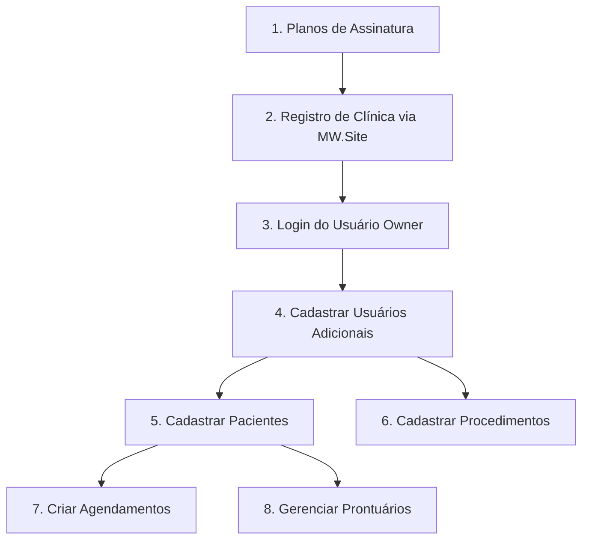

# Guia Completo de Configuração do Sistema MedicWarehouse

## 📋 Índice

1. [Visão Geral](#visão-geral)
2. [Pré-requisitos](#pré-requisitos)
3. [Configuração Inicial](#configuração-inicial)
4. [Fluxo de Cadastro Correto](#fluxo-de-cadastro-correto)
5. [Exemplos Swagger](#exemplos-swagger)
6. [Exemplos Postman](#exemplos-postman)
7. [Troubleshooting](#troubleshooting)

---

## 🎯 Visão Geral

Este guia explica a **ordem correta** para configurar e cadastrar todos os componentes do sistema MedicWarehouse. Seguir esta ordem é essencial para garantir que o sistema funcione corretamente.

### ⚠️ Importante: Autenticação Sempre Obrigatória

O sistema **sempre requer autenticação JWT**. Não existe mais a opção de desabilitar autenticação, garantindo máxima segurança em todos os ambientes.

---

## 🔧 Pré-requisitos

### 1. Backend Configurado

Certifique-se de que o arquivo `appsettings.json` está configurado corretamente:

```json
{
  "ConnectionStrings": {
    "DefaultConnection": "Server=localhost;Database=MedicWarehouse;Trusted_Connection=True;TrustServerCertificate=True"
  },
  "JwtSettings": {
    "SecretKey": "SuaChaveSecretaMuitoSeguraComPeloMenos32Caracteres!@#$%",
    "ExpiryMinutes": 60,
    "Issuer": "MedicWarehouse",
    "Audience": "MedicWarehouse-API"
  }
}
```

**⚠️ Importante**: A `SecretKey` deve ter **no mínimo 32 caracteres**.

### 2. Banco de Dados

Execute as migrations para criar o banco de dados:

```bash
cd src/MedicSoft.Api
dotnet ef database update
```

### 3. Iniciar API

```bash
cd src/MedicSoft.Api
dotnet run
```

A API estará disponível em:
- HTTP: `http://localhost:5000`
- HTTPS: `https://localhost:5001`
- Swagger: `https://localhost:5001/swagger`

---

## 📝 Fluxo de Cadastro Correto

### Ordem de Cadastro:



### Detalhamento de Cada Passo:

#### **Passo 1: Planos de Assinatura** (Já Existem no Sistema)

Os planos são pré-configurados no sistema através de Seeds ou Migration inicial:

- **Trial**: 15 dias gratuitos
- **Basic**: R$ 190/mês - 2 usuários, 100 pacientes
- **Standard**: R$ 240/mês - 3 usuários, 300 pacientes
- **Premium**: R$ 320/mês - 5 usuários, ilimitado
- **Enterprise**: Sob consulta

**Não é necessário criar planos manualmente** - eles já existem no banco de dados.

#### **Passo 2: Registro de Clínica** (Público - Sem Autenticação)

Este é o **único endpoint público** do sistema. Ele cria:
- ✅ Registro da clínica
- ✅ Primeiro usuário com role `ClinicOwner`
- ✅ Assinatura no plano escolhido
- ✅ TenantId único para a clínica

**Endpoint**: `POST /api/registration`

**Dados Necessários**:
```json
{
  "clinicName": "Clínica Exemplo",
  "clinicCNPJ": "12.345.678/0001-95",
  "clinicPhone": "+5511999999999",
  "clinicEmail": "contato@clinica.com",
  "street": "Rua das Flores",
  "number": "123",
  "complement": "Sala 10",
  "neighborhood": "Centro",
  "city": "São Paulo",
  "state": "SP",
  "zipCode": "01234-567",
  "ownerName": "Dr. João Silva",
  "ownerCPF": "123.456.789-00",
  "ownerPhone": "+5511988888888",
  "ownerEmail": "joao@clinica.com",
  "username": "joao.silva",
  "password": "SenhaForte123!@",
  "planId": "guid-do-plano",
  "acceptTerms": true,
  "useTrial": true
}
```

**Resposta de Sucesso**:
```json
{
  "success": true,
  "message": "Registration successful! Welcome to MedicWarehouse. You can now login with your credentials.",
  "clinicId": "guid-da-clinica",
  "userId": "guid-do-usuario",
  "trialEndDate": "2024-11-01T00:00:00Z"
}
```

#### **Passo 3: Login do Usuário Owner** (Obter Token JWT)

Após o registro, faça login com as credenciais criadas para obter o **token JWT**.

**Endpoint**: `POST /api/auth/login`

**Dados Necessários**:
```json
{
  "username": "joao.silva",
  "password": "SenhaForte123!@",
  "tenantId": "guid-da-clinica"
}
```

**⚠️ Importante**: O `tenantId` é o **ClinicId** retornado no passo 2.

**Resposta de Sucesso**:
```json
{
  "token": "eyJhbGciOiJIUzI1NiIsInR5cCI6IkpXVCJ9...",
  "username": "joao.silva",
  "tenantId": "guid-da-clinica",
  "expiresAt": "2024-10-12T04:00:00Z"
}
```

**🔑 Guarde o Token**: Use este token em todas as próximas requisições no header:
```
Authorization: Bearer {seu-token-aqui}
```

#### **Passo 4: Cadastrar Usuários Adicionais** (Requer Autenticação)

Agora que você está autenticado como `ClinicOwner`, pode criar usuários adicionais.

**Endpoint**: `POST /api/users`

**Headers Necessários**:
```
Authorization: Bearer {seu-token}
X-Tenant-Id: {guid-da-clinica}
```

**Dados Necessários**:
```json
{
  "username": "dra.maria",
  "email": "maria@clinica.com",
  "password": "SenhaForte456!@",
  "fullName": "Dra. Maria Santos",
  "phone": "+5511977777777",
  "role": "Doctor",
  "professionalId": "CRM 12345-SP",
  "specialty": "Cardiologia"
}
```

**Roles Disponíveis**:
- `SystemAdmin` - Acesso total ao sistema
- `ClinicOwner` - Dono da clínica (já criado no registro)
- `Doctor` - Médico
- `Dentist` - Dentista
- `Nurse` - Enfermeiro(a)
- `Receptionist` - Recepcionista
- `Secretary` - Secretário(a)

#### **Passo 5: Cadastrar Pacientes** (Requer Autenticação)

**Endpoint**: `POST /api/patients`

**Headers Necessários**:
```
Authorization: Bearer {seu-token}
X-Tenant-Id: {guid-da-clinica}
```

**Dados Necessários**:
```json
{
  "name": "Carlos Eduardo Silva",
  "document": "987.654.321-00",
  "dateOfBirth": "1990-05-15",
  "gender": "Male",
  "email": "carlos@email.com",
  "phone": "+5511966666666",
  "address": {
    "street": "Av. Paulista",
    "number": "1000",
    "complement": "Apto 101",
    "neighborhood": "Bela Vista",
    "city": "São Paulo",
    "state": "SP",
    "zipCode": "01310-100"
  },
  "emergencyContact": "+5511955555555",
  "bloodType": "O+",
  "allergies": "Nenhuma",
  "chronicDiseases": "Nenhuma",
  "currentMedications": "Nenhuma"
}
```

#### **Passo 6: Cadastrar Procedimentos** (Requer Autenticação)

**Endpoint**: `POST /api/procedures`

**Headers Necessários**:
```
Authorization: Bearer {seu-token}
X-Tenant-Id: {guid-da-clinica}
```

**Dados Necessários**:
```json
{
  "name": "Consulta Cardiológica",
  "code": "CARD-001",
  "description": "Consulta de rotina em cardiologia",
  "price": 250.00,
  "durationMinutes": 30,
  "category": "Consultation"
}
```

#### **Passo 7: Criar Agendamentos** (Requer Autenticação)

**Endpoint**: `POST /api/appointments`

**Headers Necessários**:
```
Authorization: Bearer {seu-token}
X-Tenant-Id: {guid-da-clinica}
```

**Dados Necessários**:
```json
{
  "patientId": "guid-do-paciente",
  "appointmentDate": "2024-10-15T10:00:00Z",
  "durationMinutes": 30,
  "type": "Consultation",
  "notes": "Primeira consulta",
  "procedureIds": ["guid-do-procedimento"]
}
```

---

## 🌐 Exemplos Swagger

### 1. Acessar Swagger

Navegue para: `https://localhost:5001/swagger`

### 2. Passo a Passo no Swagger

#### **Passo 2.1: Registrar Clínica**

1. Encontre o endpoint `POST /api/registration`
2. Clique em **"Try it out"**
3. Preencha o JSON com os dados da clínica
4. Clique em **"Execute"**
5. **Copie** o `clinicId` e `userId` da resposta

#### **Passo 2.2: Fazer Login**

1. Encontre o endpoint `POST /api/auth/login`
2. Clique em **"Try it out"**
3. Preencha:
   ```json
   {
     "username": "seu-username",
     "password": "sua-senha",
     "tenantId": "clinicId-copiado-anteriormente"
   }
   ```
4. Clique em **"Execute"**
5. **Copie** o `token` da resposta

#### **Passo 2.3: Autenticar no Swagger**

1. No topo da página do Swagger, clique no botão **"Authorize"** 🔒
2. No campo "Value", digite: `Bearer {seu-token}`
3. Clique em **"Authorize"**
4. Clique em **"Close"**

Agora todos os endpoints protegidos estarão acessíveis!

#### **Passo 2.4: Adicionar Header X-Tenant-Id**

**⚠️ Importante**: Para endpoints que exigem `X-Tenant-Id`, você precisa adicioná-lo manualmente em cada requisição:

1. Em cada endpoint, após clicar "Try it out"
2. Procure por "Parameters" ou "Headers"
3. Adicione `X-Tenant-Id` com o valor do `clinicId`

---

## 📮 Exemplos Postman

### 1. Importar Collection

Importe o arquivo `MedicWarehouse-Postman-Collection.json` localizado na raiz do projeto.

### 2. Configurar Variáveis de Ambiente

Crie um Environment no Postman com as seguintes variáveis:

```
base_url = https://localhost:5001
token = (deixe vazio - será preenchido automaticamente)
tenant_id = (deixe vazio - será preenchido após registro)
clinic_id = (deixe vazio - será preenchido após registro)
user_id = (deixe vazio - será preenchido após registro)
```

### 3. Sequência de Execução no Postman

#### **3.1. Registrar Clínica**

**Request**: `POST {{base_url}}/api/registration`

**Body**:
```json
{
  "clinicName": "Clínica Postman Test",
  "clinicCNPJ": "12.345.678/0001-95",
  "clinicPhone": "+5511999999999",
  "clinicEmail": "postman@test.com",
  "street": "Rua Teste",
  "number": "100",
  "neighborhood": "Centro",
  "city": "São Paulo",
  "state": "SP",
  "zipCode": "01000-000",
  "ownerName": "Dr. Postman",
  "ownerCPF": "123.456.789-00",
  "ownerPhone": "+5511988888888",
  "ownerEmail": "postman@test.com",
  "username": "postman.test",
  "password": "Postman123!@#",
  "planId": "{{plan_id}}",
  "acceptTerms": true,
  "useTrial": true
}
```

**Tests** (adicione na aba Tests para salvar valores automaticamente):
```javascript
if (pm.response.code === 200) {
    var jsonData = pm.response.json();
    pm.environment.set("clinic_id", jsonData.clinicId);
    pm.environment.set("user_id", jsonData.userId);
    pm.environment.set("tenant_id", jsonData.clinicId);
}
```

#### **3.2. Fazer Login**

**Request**: `POST {{base_url}}/api/auth/login`

**Body**:
```json
{
  "username": "postman.test",
  "password": "Postman123!@#",
  "tenantId": "{{tenant_id}}"
}
```

**Tests**:
```javascript
if (pm.response.code === 200) {
    var jsonData = pm.response.json();
    pm.environment.set("token", jsonData.token);
}
```

#### **3.3. Configurar Header Padrão**

Para todas as requisições subsequentes, adicione nos Headers:

```
Authorization: Bearer {{token}}
X-Tenant-Id: {{tenant_id}}
```

**Dica**: Configure isso no Authorization da Collection para aplicar a todas as requests.

#### **3.4. Criar Usuário Adicional**

**Request**: `POST {{base_url}}/api/users`

**Headers**:
```
Authorization: Bearer {{token}}
X-Tenant-Id: {{tenant_id}}
```

**Body**:
```json
{
  "username": "dra.maria",
  "email": "maria@test.com",
  "password": "Maria123!@#",
  "fullName": "Dra. Maria Santos",
  "phone": "+5511977777777",
  "role": "Doctor",
  "professionalId": "CRM 12345",
  "specialty": "Cardiologia"
}
```

#### **3.5. Criar Paciente**

**Request**: `POST {{base_url}}/api/patients`

**Headers**:
```
Authorization: Bearer {{token}}
X-Tenant-Id: {{tenant_id}}
```

**Body**:
```json
{
  "name": "João da Silva",
  "document": "987.654.321-00",
  "dateOfBirth": "1985-03-20",
  "gender": "Male",
  "email": "joao@test.com",
  "phone": "+5511966666666",
  "address": {
    "street": "Rua Exemplo",
    "number": "200",
    "neighborhood": "Centro",
    "city": "São Paulo",
    "state": "SP",
    "zipCode": "01000-000"
  },
  "emergencyContact": "+5511955555555"
}
```

---

## 🔍 Troubleshooting

### ❌ Erro: "401 Unauthorized"

**Causa**: Token JWT ausente ou inválido.

**Solução**:
1. Verifique se incluiu o header: `Authorization: Bearer {token}`
2. Verifique se o token não expirou (60 minutos de validade)
3. Faça login novamente para obter um novo token

### ❌ Erro: "JWT SecretKey is not configured"

**Causa**: `JwtSettings:SecretKey` não está configurado no `appsettings.json`

**Solução**:
```json
{
  "JwtSettings": {
    "SecretKey": "SuaChaveMuitoSeguraComNoMinimo32Caracteres!@#$%",
    "ExpiryMinutes": 60,
    "Issuer": "MedicWarehouse",
    "Audience": "MedicWarehouse-API"
  }
}
```

### ❌ Erro: "JWT SecretKey must be at least 32 characters long"

**Causa**: A chave secreta configurada tem menos de 32 caracteres.

**Solução**: Use uma chave com pelo menos 32 caracteres:
```
MedicWarehouse-SecretKey-2024-@#$%MinhaChaveMuitoSegura!
```

### ❌ Erro: "CNPJ already registered"

**Causa**: Já existe uma clínica com o mesmo CNPJ no banco de dados.

**Solução**:
1. Use um CNPJ diferente, ou
2. Se for ambiente de testes, limpe o banco de dados

### ❌ Erro: "Username already taken"

**Causa**: Já existe um usuário com o mesmo username.

**Solução**:
1. Escolha um username diferente, ou
2. Faça login com o usuário existente

### ❌ Erro: "Invalid credentials"

**Causa**: Username ou senha incorretos, ou usuário inativo.

**Solução**:
1. Verifique se o username está correto (é case-insensitive)
2. Verifique se a senha está correta (é case-sensitive)
3. Verifique se o tenantId está correto
4. Certifique-se de que o usuário está ativo no banco

### ❌ Erro: "Password validation failed"

**Causa**: A senha não atende aos requisitos de segurança.

**Requisitos da Senha**:
- ✅ Mínimo 8 caracteres
- ✅ Pelo menos uma letra minúscula (a-z)
- ✅ Pelo menos uma letra maiúscula (A-Z)
- ✅ Pelo menos um dígito (0-9)
- ✅ Pelo menos um caractere especial (!@#$%^&*...)
- ❌ Não pode conter palavras fracas comuns (Password, 12345678, qwerty)

**Exemplo de senha forte**: `MedicWare2024!@#`

### ❌ Erro: "Account is disabled"

**Causa**: O usuário foi desativado no sistema.

**Solução**:
1. Entre em contato com o administrador da clínica para reativar a conta
2. Se você é o ClinicOwner, use o endpoint de ativação de usuários

### ❌ Erro: Database connection failed

**Causa**: String de conexão incorreta ou SQL Server não está rodando.

**Solução**:
1. Verifique se o SQL Server está rodando
2. Verifique a string de conexão em `appsettings.json`
3. Execute as migrations: `dotnet ef database update`

### ❌ Headers X-Tenant-Id faltando

**Causa**: Alguns endpoints requerem o header `X-Tenant-Id` explicitamente.

**Solução**:
```
X-Tenant-Id: {guid-da-clinica}
```

---

## 📊 Resumo dos Endpoints por Categoria

### 🔓 Endpoints Públicos (Sem Autenticação)

| Método | Endpoint | Descrição |
|--------|----------|-----------|
| POST | `/api/registration` | Registrar nova clínica |
| GET | `/api/registration/check-cnpj/{cnpj}` | Verificar se CNPJ existe |
| GET | `/api/registration/check-username/{username}` | Verificar disponibilidade de username |
| POST | `/api/auth/login` | Fazer login e obter token JWT |

### 🔒 Endpoints Protegidos (Requerem Autenticação)

#### Usuários
| Método | Endpoint | Permissão Necessária |
|--------|----------|---------------------|
| GET | `/api/users` | ClinicOwner, SystemAdmin |
| POST | `/api/users` | ClinicOwner, SystemAdmin |
| GET | `/api/users/{id}` | ClinicOwner, SystemAdmin |
| PUT | `/api/users/{id}` | ClinicOwner, SystemAdmin |
| DELETE | `/api/users/{id}` | ClinicOwner, SystemAdmin |

#### Pacientes
| Método | Endpoint | Permissão Necessária |
|--------|----------|---------------------|
| GET | `/api/patients` | Todos os usuários autenticados |
| POST | `/api/patients` | Receptionist, Doctor, ClinicOwner |
| GET | `/api/patients/{id}` | Todos os usuários autenticados |
| PUT | `/api/patients/{id}` | Receptionist, Doctor, ClinicOwner |
| DELETE | `/api/patients/{id}` | ClinicOwner |

#### Agendamentos
| Método | Endpoint | Permissão Necessária |
|--------|----------|---------------------|
| GET | `/api/appointments` | Todos os usuários autenticados |
| POST | `/api/appointments` | Receptionist, Doctor, ClinicOwner |
| GET | `/api/appointments/{id}` | Todos os usuários autenticados |
| PUT | `/api/appointments/{id}` | Receptionist, Doctor, ClinicOwner |
| DELETE | `/api/appointments/{id}` | ClinicOwner |

#### Prontuários Médicos
| Método | Endpoint | Permissão Necessária |
|--------|----------|---------------------|
| GET | `/api/medical-records` | Doctor, Nurse, ClinicOwner |
| POST | `/api/medical-records` | Doctor, ClinicOwner |
| GET | `/api/medical-records/{id}` | Doctor, Nurse, ClinicOwner |
| PUT | `/api/medical-records/{id}` | Doctor, ClinicOwner |

---

## 🎓 Melhores Práticas

### Segurança

1. **Nunca compartilhe tokens JWT** - Cada usuário deve ter seu próprio token
2. **Tokens expiram em 60 minutos** - Implemente refresh automático no frontend
3. **Use HTTPS em produção** - HTTP não é seguro para tokens JWT
4. **Senhas fortes são obrigatórias** - O sistema valida automaticamente
5. **TenantId isola os dados** - Cada clínica vê apenas seus próprios dados

### Performance

1. **Cache tokens JWT** - Não faça login a cada requisição
2. **Reutilize conexões** - Keep-alive HTTP
3. **Pagination** - Use parâmetros de paginação em listas grandes

### Desenvolvimento

1. **Use variáveis de ambiente** - No Postman para facilitar testes
2. **Scripts de automação** - Configure Tests no Postman para salvar valores
3. **Logs detalhados** - Ative logs para debug durante desenvolvimento
4. **Teste com dados reais** - Mas nunca em produção

---

## 📞 Suporte

Para questões ou problemas:
- **Email**: contato@medicwarehouse.com
- **GitHub Issues**: [https://github.com/MedicWarehouse/MW.Code/issues](https://github.com/MedicWarehouse/MW.Code/issues)
- **Documentação**: `/frontend/mw-docs/src/assets/docs/`

---

## 📝 Licença

Este sistema é propriedade da MedicWarehouse. Todos os direitos reservados.
