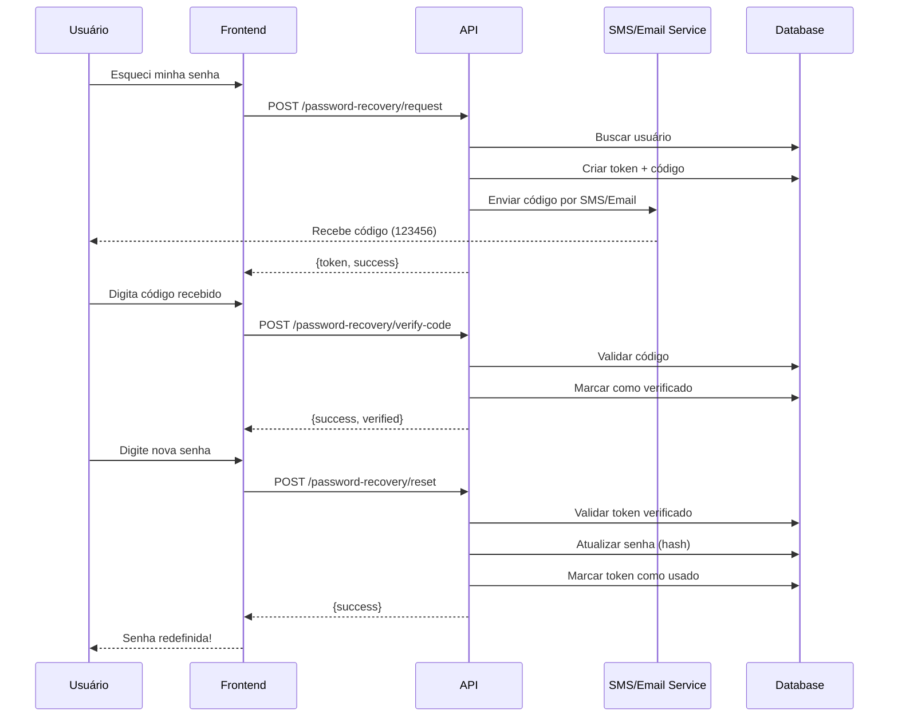

# Fluxo de Recuperação de Senha com 2FA

## Visão Geral

O sistema MedicWarehouse implementa um fluxo completo de recuperação de senha com autenticação em duas etapas (2FA), garantindo segurança máxima no processo de reset de senha.

## Características

- ✅ Autenticação em 2 etapas (SMS ou Email)
- ✅ Códigos de verificação de 6 dígitos
- ✅ Tokens seguros com expiração de 15 minutos
- ✅ Limite de 5 tentativas de verificação
- ✅ Invalidação automática de tokens antigos
- ✅ Validação de força de senha
- ✅ Segurança contra enumeração de usuários

---

## Fluxo Completo

### 1️⃣ Solicitar Recuperação de Senha

**Endpoint**: `POST /api/password-recovery/request`

**Request**:
```json
{
  "usernameOrEmail": "joao@clinica.com",
  "method": "Email"  // ou "SMS"
}
```

**Response (Sucesso)**:
```json
{
  "success": true,
  "message": "Código de verificação enviado com sucesso.",
  "token": "xYz123AbC456DeF789...",
  "method": "Email",
  "expiresInMinutes": 15
}
```

**Comportamento**:
1. Sistema verifica se usuário existe (mas não revela isso por segurança)
2. Invalida todos os tokens anteriores deste usuário
3. Gera token seguro único (32 bytes, Base64)
4. Gera código de verificação de 6 dígitos
5. Envia código via SMS ou Email
6. Retorna token para próxima etapa

**Segurança**:
- Mesmo se o usuário não existir, retorna resposta de sucesso para evitar enumeração
- Tokens antigos são automaticamente invalidados
- Código expira em 15 minutos

---

### 2️⃣ Verificar Código 2FA

**Endpoint**: `POST /api/password-recovery/verify-code`

**Request**:
```json
{
  "token": "xYz123AbC456DeF789...",
  "code": "123456"
}
```

**Response (Código Correto)**:
```json
{
  "success": true,
  "message": "Código verificado com sucesso. Você pode redefinir sua senha agora.",
  "token": "xYz123AbC456DeF789..."
}
```

**Response (Código Incorreto)**:
```json
{
  "message": "Código de verificação incorreto.",
  "attemptsRemaining": 4
}
```

**Validações**:
- ❌ Token inválido ou expirado
- ❌ Token já foi utilizado
- ❌ Mais de 5 tentativas de verificação
- ✅ Código correto

**Comportamento**:
1. Valida token e expiração
2. Verifica se não excedeu 5 tentativas
3. Compara código informado com o armazenado
4. Se correto, marca token como verificado
5. Se incorreto, incrementa contador de tentativas

---

### 3️⃣ Redefinir Senha

**Endpoint**: `POST /api/password-recovery/reset`

**Request**:
```json
{
  "token": "xYz123AbC456DeF789...",
  "newPassword": "NovaSenha@Segura123!"
}
```

**Response (Sucesso)**:
```json
{
  "success": true,
  "message": "Senha redefinida com sucesso. Você pode fazer login com sua nova senha."
}
```

**Validações**:
- ❌ Token inválido, não verificado ou expirado
- ❌ Senha fraca (não atende requisitos)
- ✅ Token válido e verificado
- ✅ Senha forte

**Requisitos de Senha**:
- Mínimo 8 caracteres (12 em produção)
- Pelo menos 1 letra maiúscula
- Pelo menos 1 letra minúscula
- Pelo menos 1 dígito
- Pelo menos 1 caractere especial
- Não pode ser senha comum (ex: "Password123!")

**Comportamento**:
1. Valida token verificado
2. Valida força da nova senha
3. Atualiza senha do usuário (hash BCrypt)
4. Marca token como usado
5. Invalida todos os outros tokens do usuário

---

### 4️⃣ Reenviar Código (Opcional)

**Endpoint**: `POST /api/password-recovery/resend-code`

**Request**:
```json
{
  "token": "xYz123AbC456DeF789..."
}
```

**Response**:
```json
{
  "success": true,
  "message": "Código de verificação reenviado com sucesso.",
  "token": "xYz123AbC456DeF789...",
  "method": "Email",
  "expiresInMinutes": 12
}
```

**Comportamento**:
- Reenvia o mesmo código de verificação
- Não gera novo token ou código
- Útil se o usuário não recebeu o email/SMS

---

## Diagrama de Fluxo



---

## Exemplos de Implementação

### Frontend (Angular/TypeScript)

```typescript
// 1. Solicitar recuperação
async requestPasswordReset(email: string, method: 'Email' | 'SMS') {
  const response = await this.http.post('/api/password-recovery/request', {
    usernameOrEmail: email,
    method: method
  }).toPromise();
  
  return response.token;
}

// 2. Verificar código
async verifyCode(token: string, code: string) {
  try {
    await this.http.post('/api/password-recovery/verify-code', {
      token: token,
      code: code
    }).toPromise();
    return true;
  } catch (error) {
    console.error('Código incorreto:', error);
    return false;
  }
}

// 3. Redefinir senha
async resetPassword(token: string, newPassword: string) {
  await this.http.post('/api/password-recovery/reset', {
    token: token,
    newPassword: newPassword
  }).toPromise();
}
```

### Teste Manual com cURL

```bash
# 1. Solicitar reset
curl -X POST http://localhost:5000/api/password-recovery/request \
  -H "Content-Type: application/json" \
  -d '{
    "usernameOrEmail": "admin@clinica.com",
    "method": "Email"
  }'

# Response: {"token": "abc123...", "success": true}

# 2. Verificar código
curl -X POST http://localhost:5000/api/password-recovery/verify-code \
  -H "Content-Type: application/json" \
  -d '{
    "token": "abc123...",
    "code": "123456"
  }'

# 3. Resetar senha
curl -X POST http://localhost:5000/api/password-recovery/reset \
  -H "Content-Type: application/json" \
  -d '{
    "token": "abc123...",
    "newPassword": "NovaSenha@Forte123!"
  }'
```

---

## Banco de Dados

### Tabela: PasswordResetTokens

```sql
CREATE TABLE PasswordResetTokens (
    Id uniqueidentifier PRIMARY KEY,
    UserId uniqueidentifier NOT NULL,
    Token nvarchar(100) NOT NULL UNIQUE,
    VerificationCode nvarchar(10) NOT NULL,
    Method int NOT NULL, -- 0=Email, 1=SMS
    Destination nvarchar(200) NOT NULL,
    ExpiresAt datetime2 NOT NULL,
    IsUsed bit NOT NULL DEFAULT 0,
    IsVerified bit NOT NULL DEFAULT 0,
    VerifiedAt datetime2 NULL,
    UsedAt datetime2 NULL,
    VerificationAttempts int NOT NULL DEFAULT 0,
    TenantId nvarchar(100) NOT NULL,
    CreatedAt datetime2 NOT NULL,
    UpdatedAt datetime2 NULL,
    
    FOREIGN KEY (UserId) REFERENCES Users(Id)
);

CREATE INDEX IX_PasswordResetTokens_Token ON PasswordResetTokens(Token);
CREATE INDEX IX_PasswordResetTokens_UserId ON PasswordResetTokens(UserId);
CREATE INDEX IX_PasswordResetTokens_Expiration 
    ON PasswordResetTokens(TenantId, IsUsed, ExpiresAt);
```

---

## Segurança

### ✅ Medidas Implementadas

1. **Tokens Seguros**
   - Gerados com `RandomNumberGenerator.Create()` (criptograficamente seguro)
   - 32 bytes = 256 bits de entropia
   - Codificados em Base64 URL-safe

2. **Códigos de Verificação**
   - 6 dígitos aleatórios (1.000.000 combinações)
   - Novos códigos a cada solicitação
   - Expire em 15 minutos

3. **Rate Limiting**
   - Máximo 5 tentativas de verificação por token
   - Tokens expiram em 15 minutos
   - Um usuário não pode ter múltiplos tokens ativos

4. **Proteção contra Enumeração**
   - Sempre retorna sucesso, mesmo se usuário não existir
   - Tempo de resposta consistente

5. **Validação de Senha**
   - BCrypt com work factor 12
   - Requisitos de complexidade
   - Blacklist de senhas comuns

6. **Auditoria**
   - Todas as tentativas são logadas
   - Tracking de IPs suspeitos
   - Alertas para múltiplas tentativas

### 🔒 Melhores Práticas

- Nunca armazene o código em plain text
- Use HTTPS obrigatório
- Implemente CAPTCHA após múltiplas tentativas
- Notifique o usuário por outro canal quando senha for alterada
- Considere adicionar perguntas de segurança
- Implemente account lockout após muitas tentativas

---

## Configuração

### appsettings.json

```json
{
  "Security": {
    "MinPasswordLength": 8,  // 12 em produção
    "PasswordResetTokenExpirationMinutes": 15,
    "MaxVerificationAttempts": 5,
    "RequireHttps": true
  },
  "Notifications": {
    "SmsProvider": "Twilio",
    "EmailProvider": "SendGrid",
    "PasswordResetTemplate": "password-reset-code"
  }
}
```

---

## Integração com Serviços Externos

### SMS (Twilio - Exemplo)

```csharp
public class TwilioSmsService : ISmsNotificationService
{
    public async Task SendVerificationCode(string phoneNumber, string code)
    {
        var message = $"Seu código de verificação MedicWarehouse é: {code}. " +
                     $"Válido por 15 minutos. Não compartilhe este código.";
        
        await TwilioClient.SendMessageAsync(
            to: phoneNumber,
            from: "+5511999999999",
            body: message
        );
    }
}
```

### Email (SendGrid - Exemplo)

```csharp
public class SendGridEmailService : IEmailService
{
    public async Task SendPasswordResetCode(string email, string code, string name)
    {
        var message = new SendGridMessage
        {
            Subject = "Código de Recuperação de Senha",
            From = new EmailAddress("noreply@medicwarehouse.com", "MedicWarehouse"),
            PlainTextContent = $"Olá {name}, seu código é: {code}",
            HtmlContent = GetEmailTemplate(name, code)
        };
        
        message.AddTo(email);
        await _client.SendEmailAsync(message);
    }
}
```

---

## Testes

### Testes Unitários

```csharp
[Fact]
public async Task RequestPasswordReset_ShouldCreateToken()
{
    // Arrange
    var user = CreateTestUser();
    var request = new PasswordResetRequest 
    { 
        UsernameOrEmail = user.Email,
        Method = VerificationMethod.Email
    };
    
    // Act
    var response = await _controller.RequestPasswordReset(request);
    
    // Assert
    Assert.True(response.Success);
    Assert.NotEmpty(response.Token);
}

[Fact]
public async Task VerifyCode_WithInvalidCode_ShouldFail()
{
    // Arrange
    var token = await CreateTestToken();
    
    // Act
    var response = await _controller.VerifyCode(new VerifyCodeRequest 
    { 
        Token = token,
        Code = "999999" // wrong code
    });
    
    // Assert
    Assert.False(response.Success);
}
```

---

## Monitoramento

### Métricas Importantes

- Taxa de sucesso de recuperação de senha
- Tempo médio para completar o fluxo
- Taxa de abandono em cada etapa
- Tentativas de fraude (múltiplas tentativas falhas)
- Métodos mais usados (Email vs SMS)

### Alertas

- 🚨 Mais de 10 tentativas de recuperação do mesmo IP em 1 hora
- 🚨 Taxa de falha de verificação > 50%
- 🚨 Tokens não sendo enviados (falha em SMS/Email service)

---

## FAQ

**Q: O que acontece se o usuário solicitar múltiplos resets?**  
A: Todos os tokens anteriores são invalidados automaticamente. Apenas o mais recente é válido.

**Q: E se o código SMS não chegar?**  
A: Use o endpoint `/resend-code` ou solicite novo reset com method="Email".

**Q: O token expira mesmo se eu estiver no meio do processo?**  
A: Sim, por segurança. Você terá que iniciar um novo processo de reset.

**Q: Posso usar o mesmo token para múltiplos resets?**  
A: Não. Cada token só pode ser usado uma vez. Após redefinir a senha, ele é marcado como usado.

**Q: Como testar sem enviar SMS/Email reais?**  
A: Em desenvolvimento, os códigos são logados no console. Configure `DevelopmentMode=true` no appsettings.

---

**Última Atualização**: 2025-10-11  
**Versão**: 1.0  
**Status**: ✅ Implementado

