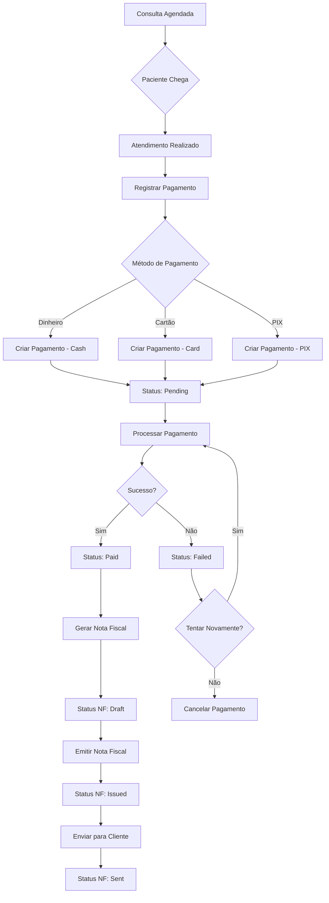
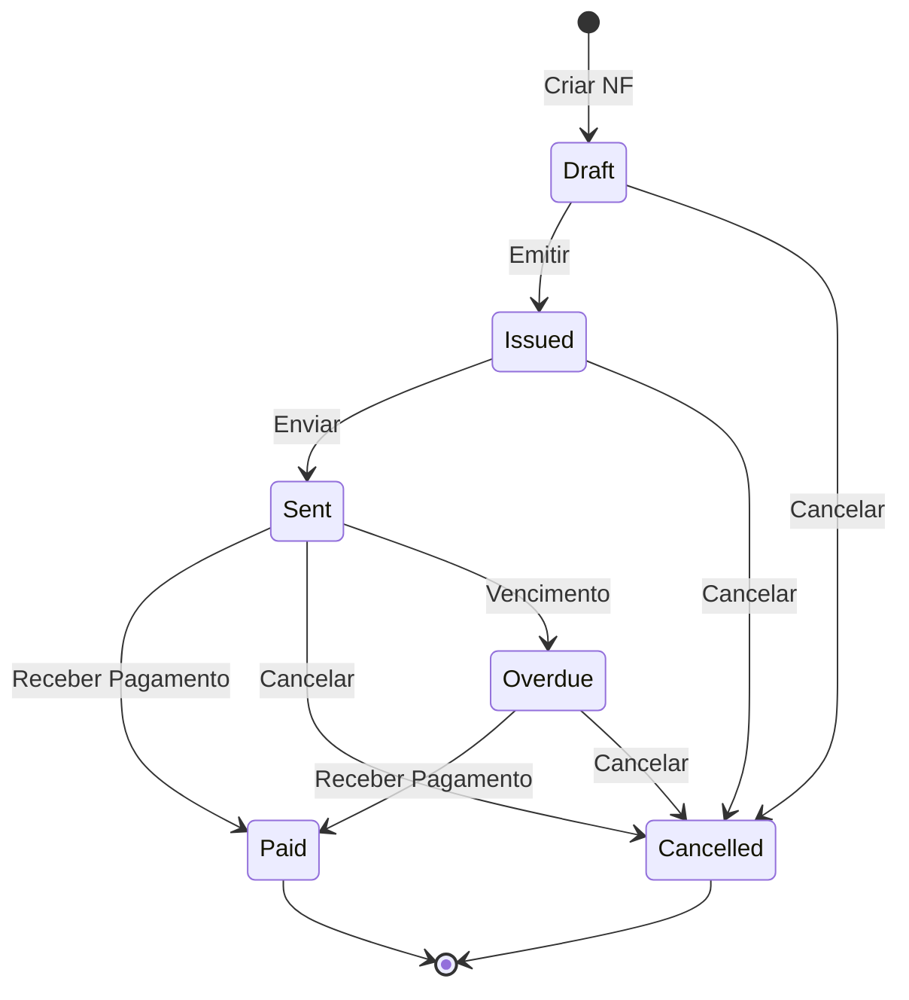
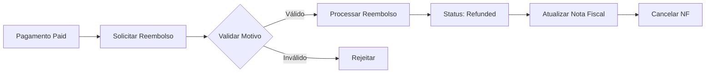
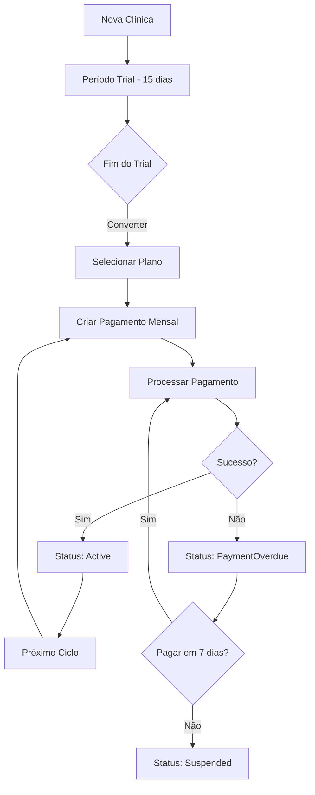

# 💰 Fluxo Financeiro - Sistema de Pagamentos e Nota Fiscal

Este documento descreve o fluxo completo de pagamentos de consultas e emissão de notas fiscais no sistema PrimeCare Software.

## 📊 Visão Geral

O sistema de pagamentos e nota fiscal foi projetado para:
- Registrar pagamentos de consultas e assinaturas
- Suportar múltiplos métodos de pagamento (Dinheiro, Cartão, PIX, etc.)
- Emitir notas fiscais automaticamente
- Controlar vencimentos e pagamentos em atraso
- Gerenciar reembolsos e cancelamentos

## 🔄 Fluxo de Pagamento de Consulta



## 💳 Métodos de Pagamento

### 1. Dinheiro (Cash)
```json
POST /api/payments
{
  "appointmentId": "guid",
  "amount": 150.00,
  "method": "Cash",
  "notes": "Pagamento em dinheiro"
}
```

### 2. Cartão de Crédito/Débito
```json
POST /api/payments
{
  "appointmentId": "guid",
  "amount": 150.00,
  "method": "CreditCard",
  "cardLastFourDigits": "1234",
  "notes": "Visa **** 1234"
}
```

### 3. PIX
```json
POST /api/payments
{
  "appointmentId": "guid",
  "amount": 150.00,
  "method": "Pix",
  "pixKey": "joao@email.com",
  "notes": "Pagamento via PIX"
}
```

## 📝 Fluxo de Nota Fiscal



### Estados da Nota Fiscal

| Estado | Descrição | Ações Permitidas |
|--------|-----------|------------------|
| **Draft** | Rascunho, não emitida | Editar valores, Emitir, Cancelar |
| **Issued** | Emitida oficialmente | Enviar, Cancelar |
| **Sent** | Enviada ao cliente | Marcar como paga |
| **Paid** | Paga pelo cliente | Nenhuma |
| **Overdue** | Vencida | Marcar como paga, Cancelar |
| **Cancelled** | Cancelada | Nenhuma |

## 🔄 Fluxo de Reembolso



### API para Reembolso
```json
PUT /api/payments/{id}/refund
{
  "paymentId": "guid",
  "reason": "Cliente solicitou cancelamento da consulta"
}
```

## 📊 Fluxo de Pagamento de Assinatura



## 📈 Relatórios Financeiros

### Endpoint para Notas Vencidas
```bash
GET /api/invoices/overdue
```

Retorna todas as notas fiscais vencidas:
```json
[
  {
    "id": "guid",
    "invoiceNumber": "NF-2024-001",
    "status": "Overdue",
    "dueDate": "2024-01-01",
    "daysOverdue": 9,
    "amount": 150.00,
    "customerName": "João Silva"
  }
]
```

### Endpoint para Pagamentos de uma Consulta
```bash
GET /api/payments/appointment/{appointmentId}
```

## 🔐 Regras de Segurança

1. **Dados Sensíveis**
   - Apenas os últimos 4 dígitos do cartão são armazenados
   - Nunca armazenar número completo do cartão
   - Nunca armazenar CVV

2. **Isolamento Multi-tenant**
   - Todos os pagamentos e notas fiscais são isolados por TenantId
   - Clínicas só acessam seus próprios dados financeiros

3. **Auditoria**
   - Todas as operações são registradas com timestamp
   - Histórico completo de mudanças de status
   - Motivos obrigatórios para reembolsos e cancelamentos

## 📱 Próximas Funcionalidades (Frontend)

### Tela de Pagamento na Consulta
- Seletor de método de pagamento com ícones
- Campo para valor com cálculo automático
- Botão "Processar Pagamento"
- Exibição do recibo após pagamento

### Lista de Pagamentos
- Grid com filtros (data, método, status)
- Ações rápidas (visualizar, reembolsar, imprimir recibo)
- Indicadores visuais de status (cores)

### Tela de Notas Fiscais
- Lista de notas com filtros
- Botões de ação (emitir, enviar, cancelar)
- Download de PDF da nota fiscal
- Alerta de notas vencidas

### Dashboard Financeiro
- Resumo de pagamentos do mês
- Gráfico de métodos de pagamento mais usados
- Lista de notas fiscais pendentes
- Indicador de pagamentos em atraso

## 🧪 Testes

O sistema possui 82 testes unitários cobrindo:
- ✅ Criação de pagamentos com todos os métodos
- ✅ Fluxo completo de pagamento (Pending → Processing → Paid)
- ✅ Reembolsos e cancelamentos
- ✅ Validações de cartão e PIX
- ✅ Criação e emissão de notas fiscais
- ✅ Cálculo de vencimento e dias em atraso
- ✅ Cancelamento de notas fiscais
- ✅ Regras de negócio e validações

```bash
# Executar testes de pagamento
dotnet test --filter "FullyQualifiedName~PaymentTests"

# Executar testes de nota fiscal
dotnet test --filter "FullyQualifiedName~InvoiceTests"
```

## 📚 Referências

- [README.md](README.md) - Visão geral do projeto
- [BUSINESS_RULES.md](BUSINESS_RULES.md) - Regras de negócio detalhadas
- [TEST_SUMMARY.md](TEST_SUMMARY.md) - Resumo completo dos testes
- [API_QUICK_GUIDE.md](API_QUICK_GUIDE.md) - Guia rápido da API

## 🎯 Conclusão

O sistema de pagamentos e nota fiscal está completamente implementado no backend com:
- ✅ Suporte para 6 métodos de pagamento
- ✅ Emissão automática de notas fiscais
- ✅ Controle de vencimentos
- ✅ Reembolsos e cancelamentos
- ✅ 82 testes automatizados
- ✅ API RESTful completa
- ✅ Documentação Swagger

O frontend pode ser desenvolvido consumindo os endpoints já disponíveis e documentados.
