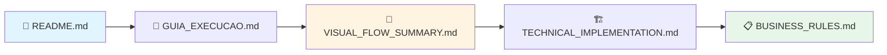
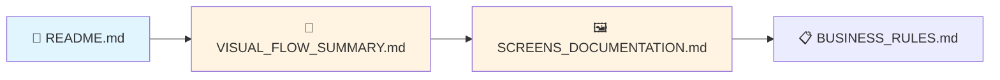
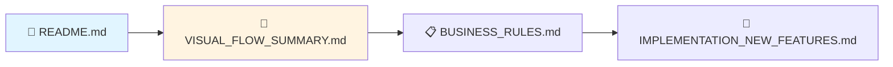
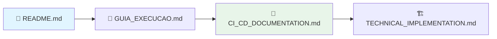

# 📚 Índice da Documentação - PrimeCare Software

Bem-vindo à documentação completa do sistema PrimeCare Software. Use este índice para encontrar rapidamente o que você procura.

---

## 🎯 Documentação por Categoria

### 📱 Interface e Experiência do Usuário

| Documento | Descrição | Tamanho | Ideal Para |
|-----------|-----------|---------|------------|
| **[SCREENS_DOCUMENTATION.md](../SCREENS_DOCUMENTATION.md)** | Documentação completa de todas as 8 telas do sistema com mockups ASCII e diagramas de fluxo | 40KB / 813 linhas | Desenvolvedores frontend, designers, analistas de UX |
| **[VISUAL_FLOW_SUMMARY.md](VISUAL_FLOW_SUMMARY.md)** | Resumo visual rápido com diagramas Mermaid interativos dos principais fluxos | 12KB / 387 linhas | Quick reference, reuniões, apresentações |

### 📋 Regras de Negócio e Requisitos

| Documento | Descrição | Tamanho | Ideal Para |
|-----------|-----------|---------|------------|
| **[BUSINESS_RULES.md](../BUSINESS_RULES.md)** | Regras de negócio detalhadas do sistema incluindo multi-tenancy, vínculos, privacidade | Extenso | Analistas de negócio, product owners, stakeholders |

### 🔧 Implementação Técnica

| Documento | Descrição | Tamanho | Ideal Para |
|-----------|-----------|---------|------------|
| **[TECHNICAL_IMPLEMENTATION.md](../TECHNICAL_IMPLEMENTATION.md)** | Arquitetura técnica, fluxos de dados, configurações do EF Core, segurança | Extenso | Desenvolvedores backend, arquitetos, DevOps |
| **[IMPLEMENTATION.md](../IMPLEMENTATION.md)** | Implementação original do sistema de atendimento ao paciente | Médio | Desenvolvedores, referência histórica |

### 🚀 Guias de Uso

| Documento | Descrição | Tamanho | Ideal Para |
|-----------|-----------|---------|------------|
| **[README.md](../README.md)** | Visão geral do projeto, funcionalidades, como executar, tecnologias | Médio | Todos os usuários, primeira leitura |
| **[GUIA_EXECUCAO.md](../GUIA_EXECUCAO.md)** | Guia passo a passo para executar o projeto localmente | Médio | Desenvolvedores, configuração inicial |
| **[API_QUICK_GUIDE.md](../API_QUICK_GUIDE.md)** | Guia rápido dos endpoints da API com exemplos | Médio | Desenvolvedores de integração, testes |

### 🔄 CI/CD e Qualidade

| Documento | Descrição | Tamanho | Ideal Para |
|-----------|-----------|---------|------------|
| **[CI_CD_DOCUMENTATION.md](../CI_CD_DOCUMENTATION.md)** | Documentação do pipeline de CI/CD com GitHub Actions | Médio | DevOps, engenheiros de CI/CD |
| **[TEST_SUMMARY.md](../TEST_SUMMARY.md)** | Resumo dos testes unitários e cobertura de código | Médio | QA, desenvolvedores |
| **[SECURITY_VALIDATIONS.md](../SECURITY_VALIDATIONS.md)** | Validações de segurança implementadas no sistema | Médio | Security engineers, auditores |

### 📝 Resumos de Implementação

| Documento | Descrição | Tamanho | Ideal Para |
|-----------|-----------|---------|------------|
| **[IMPLEMENTATION_SUMMARY.md](../IMPLEMENTATION_SUMMARY.md)** | Resumo geral das implementações | Pequeno | Visão geral rápida |
| **[IMPLEMENTATION_NEW_FEATURES.md](../IMPLEMENTATION_NEW_FEATURES.md)** | Novas funcionalidades implementadas | Pequeno | Product managers, changelog |
| **[IMPLEMENTATION_SUMMARY_BUSINESS_RULES.md](../IMPLEMENTATION_SUMMARY_BUSINESS_RULES.md)** | Resumo da implementação das regras de negócio | Pequeno | Analistas de negócio |
| **[MIGRATION_IMPLEMENTATION_SUMMARY.md](../MIGRATION_IMPLEMENTATION_SUMMARY.md)** | Resumo das migrações de banco de dados | Pequeno | DBAs, DevOps |

---

## 🗺️ Jornada de Leitura Recomendada

### 👨‍💻 Para Novos Desenvolvedores

1. **README.md** - Entenda o que é o projeto
2. **GUIA_EXECUCAO.md** - Configure e execute localmente
3. **VISUAL_FLOW_SUMMARY.md** - Veja como o sistema funciona visualmente
4. **TECHNICAL_IMPLEMENTATION.md** - Aprenda a arquitetura técnica
5. **BUSINESS_RULES.md** - Domine as regras de negócio

### 🎨 Para Designers e UX

1. **README.md** - Contexto do projeto
2. **VISUAL_FLOW_SUMMARY.md** - Fluxos principais resumidos
3. **SCREENS_DOCUMENTATION.md** - Todas as telas em detalhes
4. **BUSINESS_RULES.md** - Regras que impactam a UX

### 📊 Para Product Owners e Stakeholders

1. **README.md** - Visão geral e funcionalidades
2. **VISUAL_FLOW_SUMMARY.md** - Como os usuários navegam
3. **BUSINESS_RULES.md** - Regras implementadas
4. **IMPLEMENTATION_NEW_FEATURES.md** - Novas features

### 🔧 Para DevOps e SRE

1. **README.md** - Stack tecnológica
2. **GUIA_EXECUCAO.md** - Como executar
3. **CI_CD_DOCUMENTATION.md** - Pipeline de CI/CD
4. **TECHNICAL_IMPLEMENTATION.md** - Deploy e configurações

---

## 🔍 Busca Rápida por Tópico

### 🏥 Multi-Tenancy e Isolamento
- [BUSINESS_RULES.md](../BUSINESS_RULES.md) - Seção 1
- [TECHNICAL_IMPLEMENTATION.md](../TECHNICAL_IMPLEMENTATION.md) - Seções 1 e 2
- [SECURITY_VALIDATIONS.md](../SECURITY_VALIDATIONS.md)

### 👥 Gestão de Pacientes
- [BUSINESS_RULES.md](../BUSINESS_RULES.md) - Seção 1
- [SCREENS_DOCUMENTATION.md](../SCREENS_DOCUMENTATION.md) - Telas 4 e 5
- [VISUAL_FLOW_SUMMARY.md](VISUAL_FLOW_SUMMARY.md) - Fluxo 3

### 📅 Agendamentos e Atendimento
- [BUSINESS_RULES.md](../BUSINESS_RULES.md) - Seções 3 e 4
- [SCREENS_DOCUMENTATION.md](../SCREENS_DOCUMENTATION.md) - Telas 6, 7 e 8
- [VISUAL_FLOW_SUMMARY.md](VISUAL_FLOW_SUMMARY.md) - Fluxos 1 e 2

### 📋 Prontuários e Timeline
- [BUSINESS_RULES.md](../BUSINESS_RULES.md) - Seção 5
- [TECHNICAL_IMPLEMENTATION.md](../TECHNICAL_IMPLEMENTATION.md) - Seção 5
- [SCREENS_DOCUMENTATION.md](../SCREENS_DOCUMENTATION.md) - Tela 8

### 💊 Medicamentos e Prescrições
- [BUSINESS_RULES.md](../BUSINESS_RULES.md) - Seção 7
- [README.md](../README.md) - Funcionalidades
- [SCREENS_DOCUMENTATION.md](../SCREENS_DOCUMENTATION.md) - Tela 8

### 🔐 Segurança e Autenticação
- [SECURITY_VALIDATIONS.md](../SECURITY_VALIDATIONS.md)
- [TECHNICAL_IMPLEMENTATION.md](../TECHNICAL_IMPLEMENTATION.md)
- [README.md](../README.md) - Seção Segurança

### 🎨 Interface e Fluxos
- [SCREENS_DOCUMENTATION.md](../SCREENS_DOCUMENTATION.md) - **Principal**
- [VISUAL_FLOW_SUMMARY.md](VISUAL_FLOW_SUMMARY.md) - **Resumo Rápido**
- [BUSINESS_RULES.md](../BUSINESS_RULES.md) - Seção 6

### 🔄 API e Integrações
- [API_QUICK_GUIDE.md](../API_QUICK_GUIDE.md) - **Guia Principal**
- [TECHNICAL_IMPLEMENTATION.md](../TECHNICAL_IMPLEMENTATION.md) - Fluxos de dados
- [README.md](../README.md) - Documentação da API

---

## 📊 Estatísticas da Documentação

| Categoria | Arquivos | Linhas Totais | Tamanho |
|-----------|----------|---------------|---------|
| **Interface e UX** | 2 | ~1.200 | ~52KB |
| **Regras de Negócio** | 1 | ~520 | ~27KB |
| **Implementação Técnica** | 2 | ~900 | ~48KB |
| **Guias e Referências** | 3 | ~600 | ~35KB |
| **CI/CD e Qualidade** | 3 | ~450 | ~25KB |
| **Resumos** | 4 | ~350 | ~18KB |
| **TOTAL** | **15** | **~4.020** | **~205KB** |

---

## 🆕 Última Atualização

**Data**: Janeiro 2025  
**Versão**: 1.0  
**Novos Documentos Adicionados**:
- ✅ SCREENS_DOCUMENTATION.md (40KB, 813 linhas)
- ✅ VISUAL_FLOW_SUMMARY.md (12KB, 387 linhas)
- ✅ docs/INDEX.md (este documento)

---

## 🤝 Como Contribuir com a Documentação

1. **Identifique o documento correto** usando este índice
2. **Siga o padrão existente** (formato Markdown, diagramas Mermaid)
3. **Atualize o índice** se criar novos documentos
4. **Mantenha links internos** funcionando
5. **Use emojis** para melhorar legibilidade
6. **Adicione diagramas** quando aplicável

---

## 📞 Suporte

Se você não encontrou o que procura neste índice:
1. Use a busca do GitHub no repositório
2. Verifique as Issues existentes
3. Abra uma nova Issue com sua dúvida
4. Entre em contato: contato@medicwarehouse.com

---

**Equipe PrimeCare Software** | [GitHub](https://github.com/PrimeCare Software/MW.Code)
