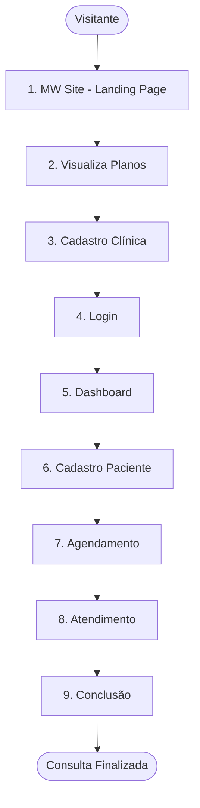

# 📱 Fluxo Completo do Sistema PrimeCare Software
## Do Site à Conclusão da Consulta

> **Objetivo:** Este documento apresenta o fluxo completo do sistema PrimeCare Software, desde a primeira visita ao site até a conclusão de uma consulta médica, incluindo screenshots e diagramas visuais de cada etapa.

> **Última Atualização:** Dezembro 2025

---

## 📋 Índice

1. [Visão Geral do Fluxo](#visão-geral-do-fluxo)
2. [Etapa 1: Site Institucional (MW Site)](#etapa-1-site-institucional-mw-site)
3. [Etapa 2: Cadastro da Clínica](#etapa-2-cadastro-da-clínica)
4. [Etapa 3: Login no Sistema](#etapa-3-login-no-sistema)
5. [Etapa 4: Dashboard Principal](#etapa-4-dashboard-principal)
6. [Etapa 5: Cadastro de Paciente](#etapa-5-cadastro-de-paciente)
7. [Etapa 6: Agendamento de Consulta](#etapa-6-agendamento-de-consulta)
8. [Etapa 7: Realização da Consulta](#etapa-7-realização-da-consulta)
9. [Etapa 8: Conclusão do Atendimento](#etapa-8-conclusão-do-atendimento)

---

## 🗺️ Visão Geral do Fluxo

---

## Documentação Completa de Fluxos

Este documento consolida a jornada completa do usuário desde o primeiro acesso ao site até a conclusão de uma consulta médica.

### Fluxo Detalhado

**1. Site Institucional (MW Site)** - O usuário acessa o site de marketing e conhece o produto
- URL: `https://medicwarehouse.com.br` ou `http://localhost:4300`
- Páginas: Home, Funcionalidades, Planos, Depoimentos, Contato

**2. Cadastro (Wizard de 5 Etapas)**
- Informações da Clínica
- Endereço
- Dados do Responsável  
- Criar Acesso
- Escolha do Plano (15 dias de teste grátis)

**3. Login** - Autenticação no sistema
- Suporte a login por subdomínio
- JWT Token com multi-tenancy

**4. Dashboard** - Hub central do sistema
- Visão geral
- Ações rápidas
- Cards de módulos

**5. Cadastro de Paciente**
- Dados pessoais, contato, endereço
- Informações médicas (histórico, alergias)

**6. Agendamento de Consulta**
- Seleção de paciente
- Data, horário, duração, tipo

**7. Atendimento/Consulta**
- Prontuário eletrônico
- Histórico do paciente
- Timer automático

**8. Conclusão**
- Diagnóstico e prescrição
- Finalização da consulta
- Impressão de documentos

---

## 📸 Screenshots de Referência

### Telas Disponíveis

- **Login**: 
- **Cadastro**: 
- **Dashboard**: 
- **Lista de Pacientes**: 
- **Formulário de Paciente**: 

---

## 🔗 Documentação Relacionada

Para informações detalhadas sobre cada tela e fluxo:

- [TELAS_COM_FLUXO.md](TELAS_COM_FLUXO.md) - Mockups ASCII completos de todas as telas
- [SCREENSHOTS_DOCUMENTATION.md](SCREENSHOTS_DOCUMENTATION.md) - Screenshots reais do sistema
- [SCREENS_DOCUMENTATION.md](SCREENS_DOCUMENTATION.md) - Documentação técnica detalhada
- [MW_SITE_DOCUMENTATION.md](MW_SITE_DOCUMENTATION.md) - Documentação do site institucional
- [VISUAL_FLOW_SUMMARY.md](VISUAL_FLOW_SUMMARY.md) - Diagramas Mermaid dos fluxos

---

**© 2025 PrimeCare Software - Todos os direitos reservados**
