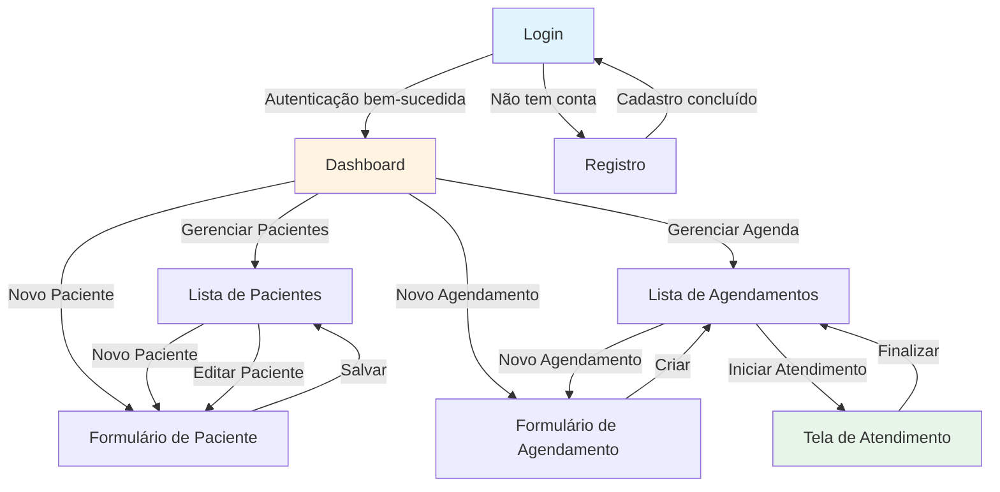
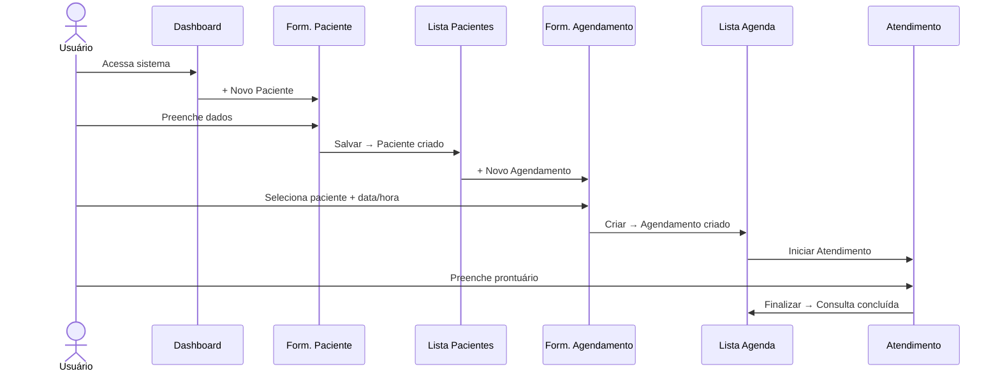
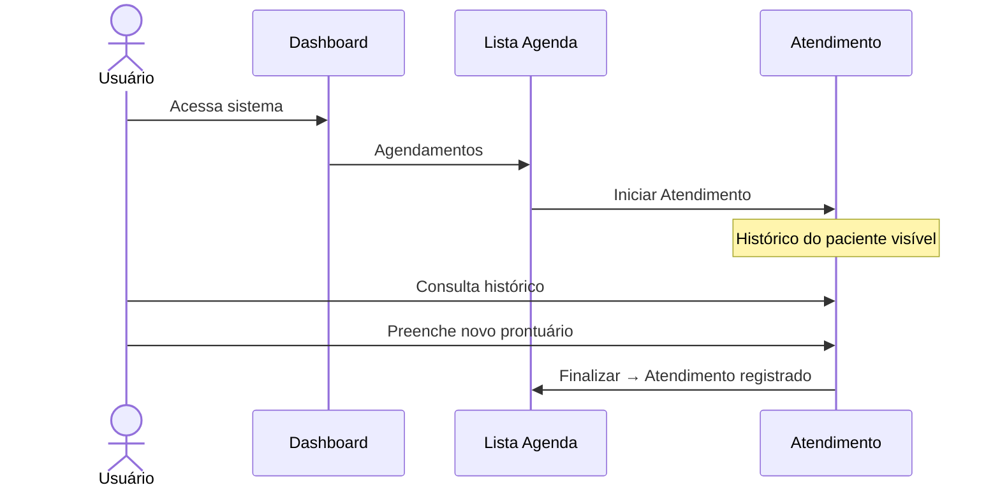
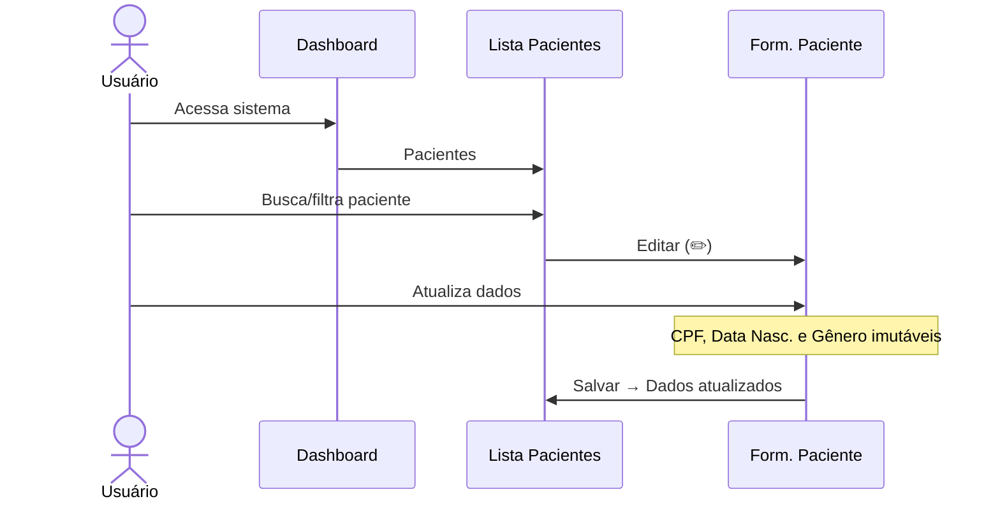
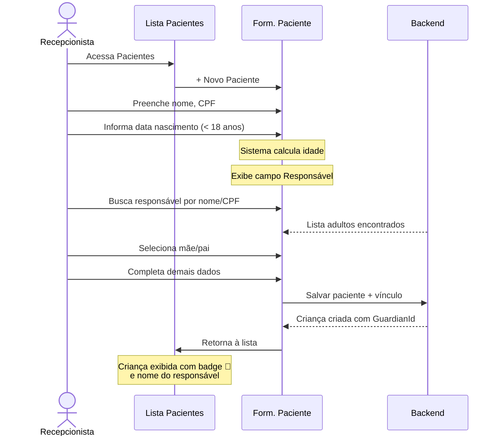
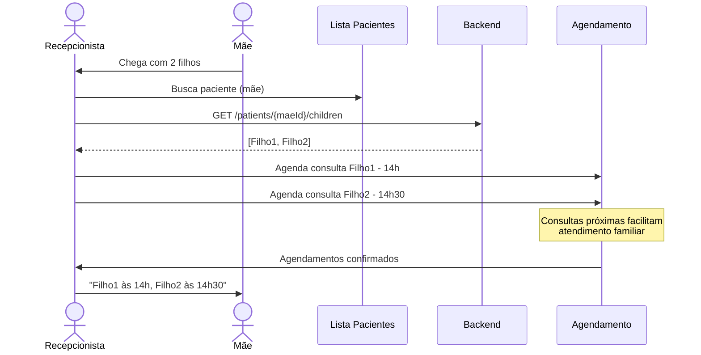
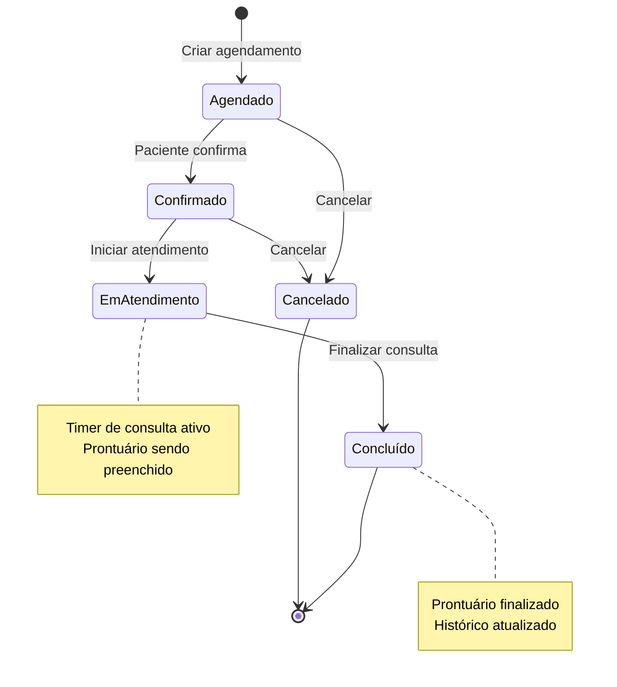

# Documentação de Telas e Fluxos - Omni Care Software

Este documento apresenta todas as telas do sistema Omni Care Software com seus fluxos de navegação e funcionalidades.

## 🖼️ Screenshots do Sistema

O sistema foi redesenhado com um layout moderno inspirado em plataformas líderes de healthcare como Doctolib, Practo e Epic Systems.

### Tela de Login


### Tela de Cadastro


### Dashboard


### Lista de Pacientes


### Formulário de Paciente


---

## 📱 Índice de Telas

1. [Tela de Login](#1-tela-de-login)
2. [Tela de Cadastro](#2-tela-de-cadastro)
3. [Dashboard](#3-dashboard)
4. [Lista de Pacientes](#4-lista-de-pacientes)
5. [Formulário de Paciente](#5-formulário-de-paciente)
6. [Lista de Agendamentos](#6-lista-de-agendamentos)
7. [Formulário de Agendamento](#7-formulário-de-agendamento)
8. [Tela de Atendimento](#8-tela-de-atendimento)

---

## 🔄 Fluxo Principal de Navegação



---

## 1. Tela de Login

### 📋 Descrição
Primeira tela do sistema onde o usuário faz autenticação para acessar o Omni Care Software.

### 🎨 Elementos da Interface

```
┌─────────────────────────────────────────────┐
│         Omni Care Software Logo                 │
│  Sistema de Gestão para Consultórios       │
│                                             │
│  ┌─────────────────────────────────┐       │
│  │ Usuário                          │       │
│  │ [____________________________]   │       │
│  └─────────────────────────────────┘       │
│                                             │
│  ┌─────────────────────────────────┐       │
│  │ Senha                            │       │
│  │ [____________________________]   │       │
│  └─────────────────────────────────┘       │
│                                             │
│  ┌─────────────────────────────────┐       │
│  │ Tenant ID                        │       │
│  │ [____________________________]   │       │
│  └─────────────────────────────────┘       │
│                                             │
│         [ Entrar ]                          │
│                                             │
│  Não tem conta? [Cadastre-se]              │
└─────────────────────────────────────────────┘
```

### ⚙️ Funcionalidades
- **Autenticação de usuário**: Valida credenciais (usuário, senha, tenant ID)
- **Validação de campos**: Todos os campos são obrigatórios
- **Feedback de erro**: Exibe mensagens de erro em caso de falha
- **Link para registro**: Permite navegar para tela de cadastro

### 🔗 Navegação
- **Para Dashboard**: Após login bem-sucedido
- **Para Registro**: Link "Cadastre-se"

### 🔐 Validações
- Usuário: Obrigatório
- Senha: Obrigatório
- Tenant ID: Opcional (para sistema multi-tenant)

---

## 2. Tela de Cadastro

### 📋 Descrição
Permite que novos usuários criem uma conta no sistema.

### 🎨 Elementos da Interface

```
┌─────────────────────────────────────────────┐
│            Cadastro                         │
│     Crie sua conta no Omni Care Software        │
│                                             │
│  ┌─────────────────────────────────┐       │
│  │ Usuário                          │       │
│  │ [____________________________]   │       │
│  └─────────────────────────────────┘       │
│                                             │
│  ┌─────────────────────────────────┐       │
│  │ E-mail                           │       │
│  │ [____________________________]   │       │
│  └─────────────────────────────────┘       │
│                                             │
│  ┌─────────────────────────────────┐       │
│  │ Senha                            │       │
│  │ [____________________________]   │       │
│  └─────────────────────────────────┘       │
│                                             │
│  ┌─────────────────────────────────┐       │
│  │ Confirmar Senha                  │       │
│  │ [____________________________]   │       │
│  └─────────────────────────────────┘       │
│                                             │
│  ┌─────────────────────────────────┐       │
│  │ Tenant ID                        │       │
│  │ [____________________________]   │       │
│  └─────────────────────────────────┘       │
│                                             │
│         [ Cadastrar ]                       │
│                                             │
│  Já tem conta? [Faça login]                │
└─────────────────────────────────────────────┘
```

### ⚙️ Funcionalidades
- **Criação de nova conta**: Cadastra novo usuário no sistema
- **Validação de dados**: Valida formato de e-mail, força de senha, etc.
- **Confirmação de senha**: Verifica se as senhas coincidem
- **Feedback**: Exibe mensagens de sucesso ou erro

### 🔗 Navegação
- **Para Login**: Após cadastro bem-sucedido ou via link "Faça login"

### 🔐 Validações
- Usuário: Mínimo 3 caracteres
- E-mail: Formato válido
- Senha: Mínimo 6 caracteres
- Confirmar Senha: Deve coincidir com a senha
- Tenant ID: Opcional

---

## 3. Dashboard

### 📋 Descrição
Tela principal após login, apresenta visão geral do sistema e acesso rápido às principais funcionalidades.

### 🎨 Elementos da Interface

```
┌────────────────────────────────────────────────────────────┐
│  [Omni Care Software] [Dashboard] [Pacientes] [Agenda] [Sair] │
├────────────────────────────────────────────────────────────┤
│                                                            │
│  Dashboard                                                 │
│  Bem-vindo ao Omni Care Software                              │
│                                                            │
│  ┌──────────────┐  ┌──────────────┐  ┌──────────────┐   │
│  │   👥         │  │   📅         │  │   💲         │   │
│  │  Pacientes   │  │ Agendamentos │  │  Financeiro  │   │
│  │              │  │              │  │              │   │
│  │ Gerenciar    │  │ Gerenciar    │  │ Controle de  │   │
│  │ cadastro de  │  │ consultas e  │  │ pagamentos   │   │
│  │ pacientes    │  │ agenda       │  │              │   │
│  │              │  │              │  │ [Em breve]   │   │
│  └──────────────┘  └──────────────┘  └──────────────┘   │
│                                                            │
│  ┌──────────────┐                                         │
│  │   📋         │                                         │
│  │ Prontuários  │                                         │
│  │              │                                         │
│  │ Histórico    │                                         │
│  │ médico dos   │                                         │
│  │ pacientes    │                                         │
│  │ [Em breve]   │                                         │
│  └──────────────┘                                         │
│                                                            │
│  Ações Rápidas                                            │
│  ┌──────────────────┐  ┌──────────────────┐             │
│  │ + Novo Paciente  │  │ + Novo           │             │
│  │                  │  │   Agendamento    │             │
│  └──────────────────┘  └──────────────────┘             │
└────────────────────────────────────────────────────────────┘
```

### ⚙️ Funcionalidades
- **Cards de acesso rápido**: Navegação para principais módulos
  - Pacientes (ativo)
  - Agendamentos (ativo)
  - Financeiro (em desenvolvimento)
  - Prontuários (em desenvolvimento)
- **Ações rápidas**: Botões para criar novo paciente ou agendamento
- **Barra de navegação**: Acesso a todas as seções do sistema

### 🔗 Navegação
- **Para Lista de Pacientes**: Card "Pacientes" ou botão "Novo Paciente"
- **Para Lista de Agendamentos**: Card "Agendamentos" ou botão "Novo Agendamento"
- **Para Formulário de Paciente**: Botão "Novo Paciente"
- **Para Formulário de Agendamento**: Botão "Novo Agendamento"

---

## 4. Lista de Pacientes

### 📋 Descrição
Exibe todos os pacientes cadastrados na clínica com opções de gerenciamento.

### 🎨 Elementos da Interface

```
┌────────────────────────────────────────────────────────────┐
│  [Omni Care Software] [Dashboard] [Pacientes] [Agenda] [Sair] │
├────────────────────────────────────────────────────────────┤
│                                                            │
│  Pacientes                         [+ Novo Paciente]      │
│  Gerenciamento de pacientes                               │
│                                                            │
│  ┌──────────────────────────────────────────────────────┐│
│  │ Nome      │ CPF      │ Email    │ Tel    │ Resp.│ Ações││
│  ├──────────────────────────────────────────────────────┤│
│  │ João S.   │ 123.456..│ joao@... │(11)9...│  -   │✏️ 🗑️││
│  │ Maria O.  │ 987.654..│ maria@...│(21)8...│  -   │✏️ 🗑️││
│  │ 🧒Ana S.  │ 456.789..│ ana@...  │(11)7...│👤Maria│✏️ 🗑️││
│  │ 🧒Pedro S.│ 789.123..│ pedro@...│(11)9...│👤Maria│✏️ 🗑️││
│  └──────────────────────────────────────────────────────┘│
│                                                            │
└────────────────────────────────────────────────────────────┘
```

**Legenda:**
- 🧒 = Badge indicando que é criança (menor de 18 anos)
- 👤 = Ícone de responsável seguido do nome

### ⚙️ Funcionalidades
- **Listagem de pacientes**: Exibe todos os pacientes do tenant atual
- **Busca e filtros**: Permite buscar pacientes por nome, CPF, etc.
- **Ações por paciente**:
  - ✏️ **Editar**: Abre formulário de edição
  - 🗑️ **Excluir**: Remove paciente (com confirmação)
- **Novo paciente**: Botão para adicionar novo paciente
- **Estado vazio**: Mensagem quando não há pacientes cadastrados

### 🔗 Navegação
- **Para Dashboard**: Barra de navegação
- **Para Formulário de Paciente (Novo)**: Botão "Novo Paciente"
- **Para Formulário de Paciente (Editar)**: Botão de editar (✏️)

### 📊 Dados Exibidos
- Nome completo
- CPF
- E-mail
- Telefone
- Idade
- **🆕 Responsável**: Nome do responsável (se o paciente for criança)
- **🆕 Badge visual**: Indicação clara quando o paciente é menor de 18 anos

---

## 5. Formulário de Paciente

### 📋 Descrição
Formulário completo para cadastro ou edição de dados do paciente.

### 🎨 Elementos da Interface

```
┌────────────────────────────────────────────────────────────┐
│  [Omni Care Software] [Dashboard] [Pacientes] [Agenda] [Sair] │
├────────────────────────────────────────────────────────────┤
│                                                            │
│  Novo Paciente / Editar Paciente          [Voltar]       │
│                                                            │
│  ═══════════════════════════════════════════════════      │
│  Dados Pessoais                                           │
│  ───────────────────────────────────────────────────      │
│  Nome Completo *          CPF *                           │
│  [________________]        [___________]                  │
│                                                            │
│  Data de Nascimento *     Gênero *                        │
│  [__________]             [▼ Selecione]                   │
│                                                            │
│  ┌─────────────────────────────────────────────────────┐ │
│  │ 🧒 Responsável *                                    │ │
│  │ ──────────────────────────────────────────────────  │ │
│  │ [Digite nome ou CPF do responsável___________]     │ │
│  │                                                     │ │
│  │ ✓ Responsável selecionado: Maria Silva            │ │
│  │                                                     │ │
│  │ ℹ️ Crianças menores de 18 anos devem ter um        │ │
│  │   responsável cadastrado.                          │ │
│  └─────────────────────────────────────────────────────┘ │
│                                                            │
│  ═══════════════════════════════════════════════════      │
│  Contato                                                  │
│  ───────────────────────────────────────────────────      │
│  E-mail *                 Telefone *                      │
│  [________________]        [____________]                 │
│                                                            │
│  ═══════════════════════════════════════════════════      │
│  Endereço                                                 │
│  ───────────────────────────────────────────────────      │
│  CEP *                    Rua *                           │
│  [________]               [________________]              │
│                                                            │
│  Número *                 Complemento                     │
│  [_____]                  [____________]                  │
│                                                            │
│  Bairro *                 Cidade *        Estado *        │
│  [________]               [________]      [__]            │
│                                                            │
│  ═══════════════════════════════════════════════════      │
│  Informações Médicas                                      │
│  ───────────────────────────────────────────────────      │
│  Histórico Médico                                         │
│  [_____________________________________________]          │
│  [_____________________________________________]          │
│                                                            │
│  Alergias                                                 │
│  [_____________________________________________]          │
│  [_____________________________________________]          │
│                                                            │
│  [Cancelar]                              [Salvar]         │
└────────────────────────────────────────────────────────────┘
```

**Nota**: A seção de Responsável aparece automaticamente quando a idade calculada é menor que 18 anos.

### ⚙️ Funcionalidades
- **Modo Criação**: Cadastra novo paciente
- **Modo Edição**: Atualiza dados de paciente existente
- **Validações em tempo real**: Feedback imediato de erros
- **Campos obrigatórios**: Marcados com asterisco (*)
- **Campos imutáveis em edição**: CPF, Data de Nascimento e Gênero não podem ser alterados
- **Informações médicas**: Histórico e alergias importantes para atendimento
- **🆕 Seleção de Responsável para Crianças**:
  - Sistema calcula idade automaticamente ao informar data de nascimento
  - Se idade < 18 anos, campo de responsável aparece automaticamente
  - Busca de responsável por nome ou CPF
  - Apenas adultos (18+) podem ser selecionados como responsáveis
  - Validação obrigatória para crianças

### 🔗 Navegação
- **Para Lista de Pacientes**: Botão "Voltar" ou "Cancelar"
- **Após salvar**: Retorna para lista de pacientes com mensagem de sucesso

### 🔐 Validações
**Dados Pessoais:**
- Nome: Obrigatório
- CPF: Obrigatório, formato válido, único no tenant
- Data de Nascimento: Obrigatório, imutável após criação
- Gênero: Obrigatório, imutável após criação
- **🆕 Responsável**: Obrigatório se idade < 18 anos, deve ser adulto (18+)

**Contato:**
- E-mail: Obrigatório, formato válido, único no tenant
- Telefone: Obrigatório

**Endereço:**
- Todos os campos obrigatórios exceto Complemento
- CEP: Formato válido

**Informações Médicas:**
- Opcionais, mas importantes para o atendimento

---

## 6. Lista de Agendamentos

### 📋 Descrição
Visualização da agenda diária/mensal com todos os agendamentos.

### 🎨 Elementos da Interface - Modo Lista

```
┌────────────────────────────────────────────────────────────┐
│  [Omni Care Software] [Dashboard] [Pacientes] [Agenda] [Sair] │
├────────────────────────────────────────────────────────────┤
│                                                            │
│  Agendamentos                                             │
│  Agenda diária de consultas                               │
│                                                            │
│  Selecionar Data: [2024-01-15]  [📅 Ver Calendário]      │
│                                  [+ Novo Agendamento]     │
│                                                            │
│  Clínica XYZ - 5 agendamentos                            │
│                                                            │
│  ┌──────────────────────────────────────────────────┐    │
│  │ 08:00  │ João Silva                              │    │
│  │        │ Consulta Regular - 30min                │    │
│  │        │ Status: Agendado                        │    │
│  │        │ [Iniciar Atendimento] [Cancelar]       │    │
│  └──────────────────────────────────────────────────┘    │
│                                                            │
│  ┌──────────────────────────────────────────────────┐    │
│  │ 09:00  │ Maria Oliveira                          │    │
│  │        │ Retorno - 20min                         │    │
│  │        │ Status: Em Atendimento                  │    │
│  │        │ [Continuar Atendimento]                 │    │
│  └──────────────────────────────────────────────────┘    │
│                                                            │
│  ┌──────────────────────────────────────────────────┐    │
│  │ 10:30  │ Pedro Costa                             │    │
│  │        │ Emergência - 45min                      │    │
│  │        │ Status: Concluído                       │    │
│  │        │ ✓ Atendimento Concluído                 │    │
│  └──────────────────────────────────────────────────┘    │
└────────────────────────────────────────────────────────────┘
```

### 🎨 Elementos da Interface - Modo Calendário

```
┌────────────────────────────────────────────────────────────┐
│  [Omni Care Software] [Dashboard] [Pacientes] [Agenda] [Sair] │
├────────────────────────────────────────────────────────────┘
│                                                            │
│  Agendamentos                                             │
│  Agenda diária de consultas                               │
│                                                            │
│  Selecionar Data: [2024-01-15]  [📋 Ver Lista]           │
│                                  [+ Novo Agendamento]     │
│                                                            │
│        ◄  Janeiro 2024  ►                                 │
│                                                            │
│  ┌────────────────────────────────────────────────┐      │
│  │ Dom  Seg  Ter  Qua  Qui  Sex  Sáb            │      │
│  ├────────────────────────────────────────────────┤      │
│  │  31   1    2    3    4    5    6              │      │
│  │   7   8    9   10   11   12   13              │      │
│  │  14  [15]  16   17   18   19   20             │      │
│  │      ●5                                        │      │
│  │  21   22   23   24   25   26   27             │      │
│  │  28   29   30   31    1    2    3              │      │
│  └────────────────────────────────────────────────┘      │
│                                                            │
│  ● Indica dias com agendamentos                           │
│  Número mostra quantidade de agendamentos                 │
└────────────────────────────────────────────────────────────┘
```

### ⚙️ Funcionalidades
- **Dois modos de visualização**:
  - **Lista**: Agendamentos do dia selecionado em ordem cronológica
  - **Calendário**: Visão mensal com indicadores de agendamentos
- **Seletor de data**: Permite escolher qualquer data
- **Status do agendamento**:
  - Agendado: Aguardando atendimento
  - Confirmado: Paciente confirmou presença
  - Em Atendimento: Consulta em andamento
  - Concluído: Atendimento finalizado
  - Cancelado: Agendamento cancelado
- **Ações por agendamento**:
  - Iniciar Atendimento: Abre tela de atendimento
  - Continuar Atendimento: Retoma atendimento em andamento
  - Cancelar: Cancela o agendamento
- **Navegação entre meses**: No modo calendário

### 🔗 Navegação
- **Para Dashboard**: Barra de navegação
- **Para Formulário de Agendamento**: Botão "Novo Agendamento"
- **Para Tela de Atendimento**: Botão "Iniciar/Continuar Atendimento"

### 📊 Dados Exibidos
- Horário do agendamento
- Nome do paciente
- Tipo de consulta
- Duração prevista
- Status atual
- Observações (se houver)

---

## 7. Formulário de Agendamento

### 📋 Descrição
Criação de novo agendamento associando paciente, data e horário.

### 🎨 Elementos da Interface

```
┌────────────────────────────────────────────────────────────┐
│  [Omni Care Software] [Dashboard] [Pacientes] [Agenda] [Sair] │
├────────────────────────────────────────────────────────────┤
│                                                            │
│  Novo Agendamento                              [Voltar]   │
│                                                            │
│  ═══════════════════════════════════════════════════      │
│  Informações do Agendamento                               │
│  ───────────────────────────────────────────────────      │
│                                                            │
│  Paciente *                                               │
│  [▼ Selecione um paciente_____________________]           │
│                                                            │
│  Data *                       Horário *                   │
│  [__________]                 [_____]                     │
│                                                            │
│  Duração (minutos) *          Tipo *                      │
│  [____]                       [▼ Regular__]               │
│                                                            │
│  Observações                                              │
│  [_____________________________________________]          │
│  [_____________________________________________]          │
│  [_____________________________________________]          │
│                                                            │
│  [Cancelar]                       [Criar Agendamento]     │
└────────────────────────────────────────────────────────────┘
```

### ⚙️ Funcionalidades
- **Seleção de paciente**: Lista todos os pacientes vinculados à clínica
- **Escolha de data e hora**: Permite agendar para qualquer data/hora
- **Duração configurável**: Múltiplos de 15 minutos
- **Tipos de consulta**:
  - Regular
  - Emergência
  - Retorno
  - Consulta
- **Observações**: Campo livre para notas adicionais
- **Validação de conflitos**: Verifica disponibilidade de horário

### 🔗 Navegação
- **Para Lista de Agendamentos**: Botão "Voltar", "Cancelar" ou após criar
- **Mensagem de sucesso**: Confirma criação do agendamento

### 🔐 Validações
- Paciente: Obrigatório, deve estar vinculado à clínica
- Data: Obrigatória, não pode ser no passado
- Horário: Obrigatório
- Duração: Obrigatória, mínimo 15 minutos
- Tipo: Obrigatório

---

## 8. Tela de Atendimento

### 📋 Descrição
Interface completa para registro do atendimento médico, prontuário e prescrições.

### 🎨 Elementos da Interface

```
┌──────────────────────────────────────────────────────────────────────┐
│  [Omni Care Software] [Dashboard] [Pacientes] [Agenda] [Sair]           │
├──────────────────────────────────────────────────────────────────────┤
│                                                                      │
│  Atendimento ao Paciente               [Voltar para Agenda]        │
│  Registro de consulta e prontuário médico                          │
│                                                                      │
│  ┌──────────────────┐  ┌──────────────────────────────────────┐   │
│  │ Informações      │  │ Prontuário Médico                     │   │
│  │ do Paciente      │  │                                       │   │
│  │                  │  │ Diagnóstico *                         │   │
│  │ Nome: João Silva │  │ [_____________________________]       │   │
│  │ Idade: 35 anos   │  │                                       │   │
│  │ CPF: 123.456.789 │  │ Prescrição *                          │   │
│  │ Tel: (11) 98765  │  │ [_____________________________]       │   │
│  │                  │  │ [_____________________________]       │   │
│  │ ⚠️ Alergias:     │  │                                       │   │
│  │ Penicilina       │  │ Observações                           │   │
│  └──────────────────┘  │ [_____________________________]       │   │
│                        │ [_____________________________]       │   │
│  ┌──────────────────┐  │                                       │   │
│  │ Tempo Consulta   │  │ Exames Solicitados                    │   │
│  │                  │  │ [_____________________________]       │   │
│  │   00:15:23       │  │                                       │   │
│  │                  │  │ Próximo Retorno                       │   │
│  │ Em andamento     │  │ [__________]                          │   │
│  └──────────────────┘  │                                       │   │
│                        │ [Salvar Rascunho] [Finalizar]         │   │
│  ┌──────────────────┐  └───────────────────────────────────────┘   │
│  │ Histórico        │                                               │
│  │                  │  ┌──────────────────────────────────────┐   │
│  │ 📅 15/12/2023    │  │ Prescrição                            │   │
│  │ Gripe comum      │  │                                       │   │
│  │ Duração: 30min   │  │ Data: 15/01/2024                     │   │
│  │                  │  │ Paciente: João Silva                  │   │
│  │ 📅 10/11/2023    │  │                                       │   │
│  │ Check-up         │  │ Medicamentos:                         │   │
│  │ Duração: 25min   │  │ • Dipirona 500mg - 1cp 6/6h          │   │
│  └──────────────────┘  │ • Amoxicilina 500mg - 1cp 8/8h       │   │
│                        │                                       │   │
│                        │              [Imprimir]               │   │
│                        └───────────────────────────────────────┘   │
└──────────────────────────────────────────────────────────────────────┘
```

### ⚙️ Funcionalidades

#### Painel Esquerdo:
- **Informações do Paciente**: 
  - Dados essenciais sempre visíveis
  - Destaque para alergias (segurança)
- **Timer de Consulta**: 
  - Contagem automática do tempo de atendimento
  - Inicia quando o atendimento é aberto
- **Histórico de Consultas**: 
  - Timeline com consultas anteriores
  - Acesso rápido a diagnósticos passados

#### Painel Direito:
- **Prontuário Médico**:
  - Diagnóstico: Campo obrigatório
  - Prescrição: Medicamentos e posologia
  - Observações: Notas adicionais
  - Exames Solicitados: Lista de exames
  - Próximo Retorno: Data de retorno (se aplicável)
- **Ações**:
  - Salvar Rascunho: Salva sem finalizar
  - Finalizar Consulta: Completa o atendimento

#### Seção de Prescrição:
- **Visualização formatada**: Prescrição pronta para impressão
- **Dados do médico**: Incluídos automaticamente
- **Impressão**: Gera documento para o paciente

### 🔗 Navegação
- **Para Lista de Agendamentos**: Botão "Voltar" ou após finalizar
- **Estado persistente**: Rascunhos são salvos automaticamente

### 🔐 Validações
- Diagnóstico: Obrigatório para finalizar consulta
- Prescrição: Obrigatória se houver medicação
- Timer: Registra automaticamente duração real da consulta

### 📊 Dados Registrados
- Diagnóstico
- Prescrição (medicamentos e dosagem)
- Observações clínicas
- Exames solicitados
- Data de retorno
- Duração da consulta
- Horário de início e fim

---

## 🔄 Fluxos de Uso Principais

### Fluxo 1: Primeiro Atendimento de Novo Paciente



### Fluxo 2: Atendimento de Paciente Existente



### Fluxo 3: Busca e Edição de Paciente



### Fluxo 4: Cadastro de Criança com Responsável



### Fluxo 5: Atendimento de Múltiplas Crianças



---

## 📋 Estados dos Agendamentos



---

## 🎨 Padrões de Interface

### Cores e Status
- 🟢 **Verde**: Sucesso, consultas concluídas
- 🔵 **Azul**: Ações primárias, informações
- 🟡 **Amarelo**: Avisos, pendências
- 🔴 **Vermelho**: Erros, alergias, cancelamentos
- ⚪ **Cinza**: Funcionalidades em desenvolvimento

### Ícones Principais
- 👥 Pacientes
- 📅 Agendamentos
- 💲 Financeiro
- 📋 Prontuários
- ✏️ Editar
- 🗑️ Excluir
- ⚠️ Alerta/Atenção

### Componentes Comuns
- **Navbar**: Presente em todas as telas (exceto login/registro)
- **Botões de ação**: Posicionados consistentemente
- **Mensagens de feedback**: Alertas de sucesso/erro no topo
- **Loading states**: Indicadores durante carregamento
- **Empty states**: Mensagens quando não há dados

---

## 🔒 Segurança e Privacidade

### Multi-Tenancy
- Todos os dados são isolados por `TenantId`
- Usuários só veem dados da sua clínica
- Busca de pacientes respeita vínculos clínica-paciente

### Proteção de Dados Sensíveis
- Campos imutáveis após criação (CPF, Data Nascimento, Gênero)
- Histórico médico isolado por clínica
- Alergias destacadas para segurança do paciente

### Auditoria
- Todas as operações registram data/hora e usuário
- Histórico completo de consultas preservado
- Modificações em prontuários são rastreadas

---

## 📱 Responsividade

O sistema é projetado para ser responsivo, adaptando-se a diferentes tamanhos de tela:

- **Desktop**: Layout completo com painéis lado a lado
- **Tablet**: Painéis empilhados, navegação otimizada
- **Mobile**: Interface simplificada, priorizando informações essenciais

---

## 🚀 Próximas Funcionalidades

Funcionalidades planejadas que aparecerão em futuras versões:

1. **Módulo Financeiro**:
   - Controle de pagamentos
   - Emissão de recibos
   - Relatórios financeiros

2. **Prontuários Expandidos**:
   - Anexar documentos e exames
   - Assinatura digital
   - Compartilhamento seguro

3. **Dashboard Analytics**:
   - Métricas de atendimento
   - Gráficos de performance
   - Relatórios gerenciais

4. **Sistema de Templates**:
   - Templates de prescrição
   - Templates de prontuário
   - Textos pré-definidos

5. **Notificações**:
   - Lembretes de consulta
   - Alertas de retorno
   - Comunicação com pacientes

---

## 📚 Documentação Relacionada

- [README.md](../README.md) - Documentação geral do projeto
- [BUSINESS_RULES.md](BUSINESS_RULES.md) - Regras de negócio detalhadas
- [TECHNICAL_IMPLEMENTATION.md](TECHNICAL_IMPLEMENTATION.md) - Implementação técnica
- [API_QUICK_GUIDE.md](API_QUICK_GUIDE.md) - Guia rápido da API

---

**Última atualização**: Janeiro 2025  
**Versão do documento**: 1.0  
**Equipe**: Omni Care Software
