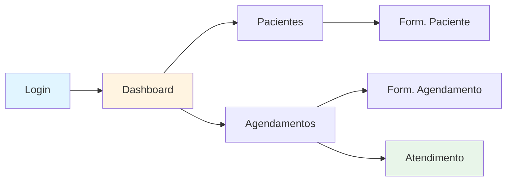

# Implementação das Regras de Negócio - Documentação Técnica

## Visão Geral

Este documento descreve a implementação técnica das regras de negócio do Omni Care Software, focando em como o sistema suporta múltiplas clínicas, isolamento de dados e templates reutilizáveis.

## Arquitetura da Solução

### 1. Multi-Tenancy com Vínculo N:N

#### Estrutura de Dados

```
Patient (1) ←→ (N) PatientClinicLink (N) ←→ (1) Clinic

Patient (Guardian/Responsável)
  └─ GuardianId → Patient (Child/Criança)
     (Self-referencing relationship)
```

**PatientClinicLink**:
- Entidade de ligação entre Patient e Clinic
- Suporta N:N relationship
- Mantém TenantId para isolamento
- Campos: PatientId, ClinicId, LinkedAt, IsActive

**Patient - Guardian/Child Relationship** (🆕):
- Auto-relacionamento na entidade Patient
- GuardianId (nullable): FK para outro Patient (responsável)
- Um adulto (Guardian) pode ter múltiplas crianças
- Uma criança pode ter apenas um responsável
- Validações:
  - Criança: idade < 18 anos
  - Guardian: idade >= 18 anos
  - Patient não pode ser responsável de si mesmo

#### Fluxo de Cadastro

```csharp
// 1. Busca paciente por CPF em todas as clínicas
GET /api/patients/by-document/{cpf}
→ PatientRepository.GetByDocumentGlobalAsync(cpf)

// 2a. Se paciente não existe
POST /api/patients
Body: {
  name: "...",
  dateOfBirth: "2015-01-01",  // Se < 18 anos
  guardianId: "{GUID}",        // Obrigatório para crianças
  ...
}
→ CreatePatientCommand
→ Cria Patient com TenantId e GuardianId

// 2b. Se paciente existe
POST /api/patients/{patientId}/link-clinic/{clinicId}
→ LinkPatientToClinicCommand
→ Cria PatientClinicLink

// 3. Vincular criança a responsável (🆕)
POST /api/patients/{childId}/link-guardian/{guardianId}
→ LinkChildToGuardianCommand
→ Define GuardianId na criança

// 4. Listar filhos de um responsável (🆕)
GET /api/patients/{guardianId}/children
→ GetChildrenOfGuardianQuery
→ Retorna todas as crianças do responsável
```

### 2. Isolamento de Prontuários

#### Query Filters Globais

```csharp
// MedicSoftDbContext.cs
protected override void OnModelCreating(ModelBuilder modelBuilder)
{
    // Filtro automático por TenantId
    modelBuilder.Entity<MedicalRecord>()
        .HasQueryFilter(mr => EF.Property<string>(mr, "TenantId") == GetTenantId());
}
```

#### Garantias de Segurança

1. **Todos os prontuários possuem TenantId**
2. **Queries automáticas filtram por TenantId**
3. **Não há endpoints cross-tenant para prontuários**
4. **Timeline do paciente é filtrada por clínica**

```csharp
// Exemplo de query automática
var records = await _context.MedicalRecords
    .Where(mr => mr.PatientId == patientId)
    .ToListAsync();
// EF Core adiciona automaticamente: && mr.TenantId == currentTenantId
```

### 3. Sistema de Templates

#### Estrutura

```
MedicalRecordTemplate
├── Id: Guid
├── Name: string (max 200)
├── Description: string (max 1000)
├── TemplateContent: string (max 10000)
├── Category: string (max 100)
├── IsActive: bool
└── TenantId: string (isolamento por clínica)

PrescriptionTemplate
├── (mesma estrutura)
```

#### Categorias Suportadas

- Clínica Médica Geral
- Odontologia
- Psicologia
- Fisioterapia
- Nutrição
- Cardiologia
- Pediatria
- Outras

#### Uso de Templates

```csharp
// Criar template
var template = new MedicalRecordTemplate(
    name: "Consulta de Rotina - Cardiologia",
    description: "Template padrão para consultas cardiológicas",
    templateContent: "Exame físico:\nPressão arterial:\nAuscuta cardíaca:\n...",
    category: "Cardiologia",
    tenantId: currentTenantId
);

// Buscar templates por categoria
GET /api/medical-record-templates/category/Cardiologia
→ Retorna templates da clínica atual filtrando por categoria
```

### 4. Busca de Pacientes

#### Implementação

```csharp
public interface IPatientRepository : IRepository<Patient>
{
    // Busca por CPF na clínica atual
    Task<Patient?> GetByDocumentAsync(string document, string tenantId);
    
    // Busca por CPF em todas as clínicas (para reutilização)
    Task<Patient?> GetByDocumentGlobalAsync(string document);
    
    // Busca por nome
    Task<IEnumerable<Patient>> SearchByNameAsync(string name, string tenantId);
    
    // Busca por telefone
    Task<IEnumerable<Patient>> SearchByPhoneAsync(string phoneNumber, string tenantId);
    
    // Busca combinada (CPF, Nome ou Telefone)
    Task<IEnumerable<Patient>> SearchAsync(string searchTerm, string tenantId);
}
```

#### Query de Busca Combinada

```csharp
public async Task<IEnumerable<Patient>> SearchAsync(string searchTerm, string tenantId)
{
    return await _dbSet
        .Where(p => (p.Name.Contains(searchTerm) || 
                    p.Document.Contains(searchTerm) || 
                    p.Phone.Number.Contains(searchTerm)) && 
                    p.TenantId == tenantId)
        .OrderBy(p => p.Name)
        .ToListAsync();
}
```

### 5. Timeline do Histórico

#### Implementação Frontend

```typescript
// attendance.ts
export class AttendanceComponent {
  patientHistory = signal<MedicalRecord[]>([]);

  async loadPatientHistory(patientId: string) {
    // Busca prontuários ordenados por data (mais recente primeiro)
    const records = await this.medicalRecordService
      .getPatientRecords(patientId)
      .toPromise();
    
    this.patientHistory.set(
      records.sort((a, b) => 
        new Date(b.consultationStartTime).getTime() - 
        new Date(a.consultationStartTime).getTime()
      )
    );
  }
}
```

#### Renderização Timeline

```html
<div class="patient-history">
  <h3>Histórico de Consultas</h3>
  @for (record of patientHistory(); track record.id) {
    <div class="history-item">
      <div class="history-date">
        {{ record.consultationStartTime | date: 'dd/MM/yyyy HH:mm' }}
      </div>
      <div class="history-info">
        <p><strong>Diagnóstico:</strong> {{ record.diagnosis }}</p>
        <p><strong>Duração:</strong> {{ record.consultationDurationMinutes }} min</p>
      </div>
    </div>
  }
</div>
```

## Fluxos de Dados

### Fluxo 1: Cadastro de Novo Paciente

```
┌─────────────┐
│  Frontend   │
└──────┬──────┘
       │ POST /api/patients
       ▼
┌─────────────────────┐
│ PatientsController  │
└──────┬──────────────┘
       │ CreatePatientCommand
       ▼
┌──────────────────────────┐
│ CreatePatientHandler     │
│ - Valida CPF único       │
│ - Valida email único     │
│ - Cria Patient           │
└──────┬───────────────────┘
       │
       ▼
┌────────────────────┐
│ PatientRepository  │
│ - AddAsync()       │
└────────────────────┘
```

### Fluxo 2: Vínculo de Paciente Existente

```
┌─────────────┐
│  Frontend   │
└──────┬──────┘
       │ GET /api/patients/by-document/{cpf}
       ▼
┌─────────────────────────────────┐
│ PatientsController              │
└──────┬──────────────────────────┘
       │ GetPatientByDocumentGlobalQuery
       ▼
┌────────────────────────────────────┐
│ GetPatientByDocumentGlobalHandler  │
│ - Busca sem filtro de tenant      │
└──────┬─────────────────────────────┘
       │
       ▼
┌────────────────────────────────┐
│ PatientRepository              │
│ - GetByDocumentGlobalAsync()   │
└────────────────────────────────┘

Se paciente encontrado:

┌─────────────┐
│  Frontend   │
└──────┬──────┘
       │ POST /api/patients/{patientId}/link-clinic/{clinicId}
       ▼
┌─────────────────────────────┐
│ PatientsController          │
└──────┬──────────────────────┘
       │ LinkPatientToClinicCommand
       ▼
┌───────────────────────────────────┐
│ LinkPatientToClinicHandler        │
│ - Verifica se link já existe      │
│ - Cria PatientClinicLink          │
└──────┬────────────────────────────┘
       │
       ▼
┌─────────────────────────────────┐
│ PatientClinicLinkRepository     │
│ - AddAsync()                     │
└─────────────────────────────────┘
```

### Fluxo 3: Busca de Pacientes

```
┌─────────────┐
│  Frontend   │
└──────┬──────┘
       │ GET /api/patients/search?searchTerm=silva
       ▼
┌─────────────────────┐
│ PatientsController  │
└──────┬──────────────┘
       │ SearchPatientsQuery
       ▼
┌──────────────────────────┐
│ SearchPatientsHandler    │
└──────┬───────────────────┘
       │
       ▼
┌────────────────────┐
│ PatientRepository  │
│ - SearchAsync()    │
│   Busca por:       │
│   • Nome           │
│   • CPF            │
│   • Telefone       │
└────────────────────┘
```

## Configurações do Entity Framework Core

### PatientConfiguration

```csharp
builder.HasMany(p => p.ClinicLinks)
    .WithOne(l => l.Patient)
    .HasForeignKey(l => l.PatientId)
    .OnDelete(DeleteBehavior.Restrict);
```

### PatientClinicLinkConfiguration

```csharp
// Índice único para evitar duplicação de vínculos
builder.HasIndex(l => new { l.PatientId, l.ClinicId, l.TenantId })
    .IsUnique()
    .HasDatabaseName("IX_PatientClinicLinks_Patient_Clinic_Tenant");
```

### MedicalRecordConfiguration

```csharp
// Índice único: um prontuário por agendamento
builder.HasIndex(mr => new { mr.TenantId, mr.AppointmentId })
    .HasDatabaseName("IX_MedicalRecords_TenantId_Appointment")
    .IsUnique();

// Índice para busca de histórico do paciente
builder.HasIndex(mr => new { mr.TenantId, mr.PatientId })
    .HasDatabaseName("IX_MedicalRecords_TenantId_Patient");
```

## Segurança e Privacidade

### 1. Isolamento por TenantId

```csharp
// Todas as entidades sensíveis herdam de BaseEntity
public abstract class BaseEntity
{
    public Guid Id { get; protected set; }
    public DateTime CreatedAt { get; protected set; }
    public DateTime? UpdatedAt { get; protected set; }
    public string TenantId { get; protected set; } // Isolamento
}
```

### 2. Query Filters Automáticos

```csharp
// Aplicado a todas as entidades sensíveis
modelBuilder.Entity<MedicalRecord>()
    .HasQueryFilter(mr => EF.Property<string>(mr, "TenantId") == GetTenantId());
```

### 3. Validações de Acesso

```csharp
// Handler sempre valida tenant
public async Task<MedicalRecordDto> Handle(
    GetMedicalRecordByAppointmentQuery request, 
    CancellationToken cancellationToken)
{
    // Query automática filtra por TenantId via query filter
    var record = await _repository.GetByAppointmentIdAsync(
        request.AppointmentId, 
        request.TenantId // Explícito para segurança adicional
    );
    
    return _mapper.Map<MedicalRecordDto>(record);
}
```

## Performance e Otimizações

### 1. Índices Estratégicos

```sql
-- Busca rápida por CPF
CREATE INDEX IX_Patients_TenantId_Document 
ON Patients (TenantId, Document);

-- Busca rápida por nome
CREATE INDEX IX_Patients_Name 
ON Patients (Name);

-- Timeline do paciente
CREATE INDEX IX_MedicalRecords_TenantId_Patient 
ON MedicalRecords (TenantId, PatientId);

-- Vínculos do paciente
CREATE INDEX IX_PatientClinicLinks_PatientId 
ON PatientClinicLinks (PatientId);
```

### 2. Eager Loading

```csharp
// Carrega vínculos com clínicas em uma query
var patient = await _context.Patients
    .Include(p => p.ClinicLinks)
        .ThenInclude(l => l.Clinic)
    .FirstOrDefaultAsync(p => p.Id == patientId);
```

### 3. Projeções para DTOs

```csharp
// Seleciona apenas campos necessários
var patients = await _context.Patients
    .Where(p => p.TenantId == tenantId)
    .Select(p => new PatientDto
    {
        Id = p.Id,
        Name = p.Name,
        Document = p.Document,
        // ... apenas campos necessários
    })
    .ToListAsync();
```

## Testes

### Testes de Entidade

```csharp
[Fact]
public void PatientClinicLink_ShouldCreateValidLink()
{
    var patientId = Guid.NewGuid();
    var clinicId = Guid.NewGuid();
    var tenantId = "tenant-1";

    var link = new PatientClinicLink(patientId, clinicId, tenantId);

    Assert.Equal(patientId, link.PatientId);
    Assert.Equal(clinicId, link.ClinicId);
    Assert.True(link.IsActive);
    Assert.NotEqual(default, link.LinkedAt);
}
```

### Testes de Repositório

```csharp
[Fact]
public async Task SearchAsync_ShouldFindPatientByCpf()
{
    var repository = new PatientRepository(_context);
    var tenantId = "tenant-1";
    
    var results = await repository.SearchAsync("123.456.789-00", tenantId);
    
    Assert.NotEmpty(results);
    Assert.Contains(results, p => p.Document == "123.456.789-00");
}
```

### Testes de Handler

```csharp
[Fact]
public async Task LinkPatientToClinic_ShouldCreateLink()
{
    var command = new LinkPatientToClinicCommand(
        patientId: Guid.NewGuid(),
        clinicId: Guid.NewGuid(),
        tenantId: "tenant-1"
    );

    var result = await _handler.Handle(command, CancellationToken.None);

    Assert.True(result);
}
```

## Migrations

### Criação das Novas Tabelas

```bash
# Gerar migration
dotnet ef migrations add AddMultiClinicSupport \
    --project src/MedicSoft.Repository \
    --startup-project src/MedicSoft.Api

# Aplicar migration
dotnet ef database update \
    --project src/MedicSoft.Repository \
    --startup-project src/MedicSoft.Api
```

### Script SQL Gerado

```sql
-- PatientClinicLinks
CREATE TABLE PatientClinicLinks (
    Id uniqueidentifier NOT NULL PRIMARY KEY,
    PatientId uniqueidentifier NOT NULL,
    ClinicId uniqueidentifier NOT NULL,
    LinkedAt datetime2 NOT NULL,
    IsActive bit NOT NULL,
    TenantId nvarchar(100) NOT NULL,
    CreatedAt datetime2 NOT NULL,
    UpdatedAt datetime2 NULL,
    CONSTRAINT FK_PatientClinicLinks_Patients 
        FOREIGN KEY (PatientId) REFERENCES Patients(Id),
    CONSTRAINT FK_PatientClinicLinks_Clinics 
        FOREIGN KEY (ClinicId) REFERENCES Clinics(Id)
);

-- MedicalRecordTemplates
CREATE TABLE MedicalRecordTemplates (
    Id uniqueidentifier NOT NULL PRIMARY KEY,
    Name nvarchar(200) NOT NULL,
    Description nvarchar(1000) NULL,
    TemplateContent nvarchar(max) NOT NULL,
    Category nvarchar(100) NOT NULL,
    IsActive bit NOT NULL,
    TenantId nvarchar(100) NOT NULL,
    CreatedAt datetime2 NOT NULL,
    UpdatedAt datetime2 NULL
);

-- PrescriptionTemplates
CREATE TABLE PrescriptionTemplates (
    Id uniqueidentifier NOT NULL PRIMARY KEY,
    Name nvarchar(200) NOT NULL,
    Description nvarchar(1000) NULL,
    TemplateContent nvarchar(max) NOT NULL,
    Category nvarchar(100) NOT NULL,
    IsActive bit NOT NULL,
    TenantId nvarchar(100) NOT NULL,
    CreatedAt datetime2 NOT NULL,
    UpdatedAt datetime2 NULL
);
```

## Considerações de Deploy

### 1. Migração de Dados Existentes

Se houver dados existentes, executar script de migração:

```sql
-- Criar vínculos para pacientes existentes
INSERT INTO PatientClinicLinks (Id, PatientId, ClinicId, LinkedAt, IsActive, TenantId, CreatedAt)
SELECT 
    NEWID(),
    p.Id as PatientId,
    c.Id as ClinicId,
    p.CreatedAt as LinkedAt,
    1 as IsActive,
    p.TenantId,
    GETUTCDATE() as CreatedAt
FROM Patients p
CROSS JOIN Clinics c
WHERE p.TenantId = c.TenantId;
```

### 2. Validações Pós-Deploy

```sql
-- Verificar vínculos criados
SELECT COUNT(*) FROM PatientClinicLinks;

-- Verificar isolamento de prontuários
SELECT DISTINCT TenantId, COUNT(*) 
FROM MedicalRecords 
GROUP BY TenantId;

-- Verificar índices
SELECT name, type_desc 
FROM sys.indexes 
WHERE object_id = OBJECT_ID('PatientClinicLinks');

-- 🆕 Verificar vínculos guardian-child
SELECT 
    c.Name as ChildName,
    c.DateOfBirth,
    DATEDIFF(YEAR, c.DateOfBirth, GETDATE()) as Age,
    g.Name as GuardianName
FROM Patients c
LEFT JOIN Patients g ON c.GuardianId = g.Id
WHERE c.GuardianId IS NOT NULL
ORDER BY c.Name;

-- 🆕 Verificar crianças sem responsável (alerta)
SELECT 
    Name,
    DateOfBirth,
    DATEDIFF(YEAR, DateOfBirth, GETDATE()) as Age
FROM Patients
WHERE DATEDIFF(YEAR, DateOfBirth, GETDATE()) < 18
  AND GuardianId IS NULL
  AND IsActive = 1;
```

### 3. Migração Guardian-Child (🆕)

Se o sistema já possui pacientes cadastrados, adicionar coluna GuardianId:

```sql
-- Adicionar coluna GuardianId à tabela Patients
ALTER TABLE Patients
ADD GuardianId uniqueidentifier NULL;

-- Criar índice
CREATE NONCLUSTERED INDEX IX_Patients_GuardianId
ON Patients (GuardianId);

-- Adicionar constraint de FK com restrição
ALTER TABLE Patients
ADD CONSTRAINT FK_Patients_Guardian
FOREIGN KEY (GuardianId) REFERENCES Patients(Id)
ON DELETE NO ACTION;

-- Script de validação: Listar crianças sem responsável
SELECT 
    Id, 
    Name, 
    Document,
    DateOfBirth,
    DATEDIFF(YEAR, DateOfBirth, GETDATE()) as Age
FROM Patients
WHERE DATEDIFF(YEAR, DateOfBirth, GETDATE()) < 18
  AND GuardianId IS NULL
ORDER BY Age DESC;

-- Nota: Administradores devem vincular manualmente 
-- crianças existentes aos seus responsáveis
```

## Fluxos Visuais e Interface

Para uma compreensão completa dos fluxos de usuário e interface do sistema, consulte:

### 📱 Documentação de Telas e Fluxos

**[SCREENS_DOCUMENTATION.md](SCREENS_DOCUMENTATION.md)** contém:

- **Mockups de todas as telas**: Representação visual de cada interface
- **Diagramas de fluxo Mermaid**: Fluxos de navegação interativos
- **Descrição detalhada**: Funcionalidades e validações de cada tela
- **Estados e transições**: Máquina de estados dos agendamentos
- **Padrões de interface**: Guidelines de UI/UX

#### Principais Fluxos Documentados:



**Fluxo 1: Primeiro Atendimento**
1. Dashboard → Novo Paciente → Cadastro
2. Lista Pacientes → Novo Agendamento
3. Agenda → Iniciar Atendimento → Prontuário

**Fluxo 2: Paciente Recorrente**
1. Dashboard → Agendamentos
2. Seleciona agendamento existente
3. Iniciar Atendimento (histórico visível)
4. Finalizar e retornar para agenda

**Fluxo 3: Busca e Vínculo**
1. Busca paciente por CPF (global)
2. Sistema detecta cadastro existente
3. Vincula à clínica atual
4. Paciente disponível para agendamento

Para detalhes completos e representações visuais de cada tela, consulte [SCREENS_DOCUMENTATION.md](SCREENS_DOCUMENTATION.md).

## Próximos Passos

1. **API de Templates**: Implementar controllers completos para templates
2. **Frontend para Templates**: Telas de gerenciamento de templates
3. **Relatórios**: Relatórios de vínculos e históricos
4. **Exportação de Dados**: Permitir exportação de prontuários (PDF/CSV)
5. **Auditoria Avançada**: Log detalhado de acessos a prontuários
6. **Notificações**: Alertar sobre novos vínculos de pacientes
7. **Dashboard**: Métricas de vínculos e uso de templates

## Referências

- [BUSINESS_RULES.md](BUSINESS_RULES.md) - Regras de negócio detalhadas
- [SCREENS_DOCUMENTATION.md](SCREENS_DOCUMENTATION.md) - **Documentação visual de telas e fluxos**
- [README.md](README.md) - Documentação geral do projeto
- [IMPLEMENTATION.md](IMPLEMENTATION.md) - Implementação original do sistema

---

**Data**: Janeiro 2025  
**Versão**: 1.0  
**Autor**: Equipe Omni Care Software
