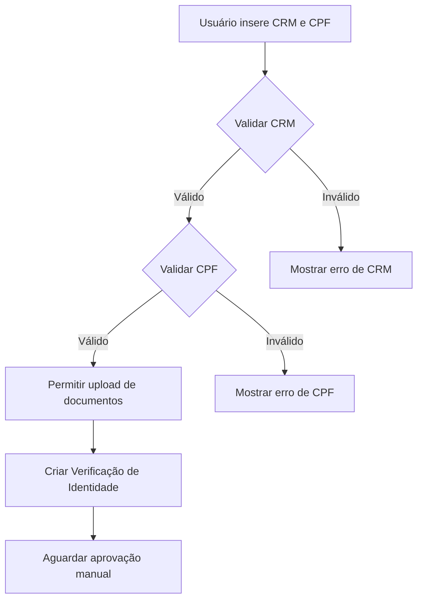

# Validação CRM e CPF - Implementação CFM API

## 📋 Visão Geral

Esta implementação adiciona validação online de CRM (Conselho Regional de Medicina) e CPF (Cadastro de Pessoas Físicas) através da API oficial do CFM (Conselho Federal de Medicina).

**API de Referência:** https://siem-servicos-api.cfm.org.br/swagger-ui/index.html

## 🎯 Funcionalidades Implementadas

### 1. Serviço de Validação CFM

**Localização:** `telemedicine/src/MedicSoft.Telemedicine.Infrastructure/ExternalServices/CfmValidationService.cs`

**Interface:** `ICfmValidationService`

**Métodos Disponíveis:**

#### ValidateCrmAsync
```csharp
Task<CfmCrmValidationResult> ValidateCrmAsync(string crmNumber, string crmState)
```

Valida um CRM junto à base de dados do CFM e retorna:
- **IsValid**: Se o CRM é válido
- **DoctorName**: Nome do médico registrado
- **CrmNumber**: Número do CRM validado
- **CrmState**: Estado (UF) do CRM
- **Specialty**: Especialidade médica
- **Status**: Situação do CRM (Ativo, Cancelado, etc.)
- **RegistrationDate**: Data de inscrição
- **ErrorMessage**: Mensagem de erro se aplicável

#### ValidateCpfAsync
```csharp
Task<CfmCpfValidationResult> ValidateCpfAsync(string cpf)
```

Valida um CPF junto à base de dados do CFM e retorna:
- **IsValid**: Se o CPF é válido
- **Cpf**: CPF validado (apenas dígitos)
- **ErrorMessage**: Mensagem de erro se aplicável

### 2. Endpoints da API

#### A. Controller Dedicado de Validação CFM

**Localização:** `telemedicine/src/MedicSoft.Telemedicine.Api/Controllers/CfmValidationController.cs`

**Endpoints:**

##### GET /api/telemedicine/CfmValidation/crm/{crmNumber}/{crmState}
Valida um CRM específico.

**Exemplo:**
```bash
curl -X GET "https://api.exemplo.com/api/telemedicine/CfmValidation/crm/123456/SP"
```

**Resposta:**
```json
{
  "isValid": true,
  "doctorName": "Dr. João Silva",
  "crmNumber": "123456",
  "crmState": "SP",
  "specialty": "Cardiologia",
  "status": "Ativo",
  "registrationDate": "2019-01-15T00:00:00Z"
}
```

##### GET /api/telemedicine/CfmValidation/cpf/{cpf}
Valida um CPF.

**Exemplo:**
```bash
curl -X GET "https://api.exemplo.com/api/telemedicine/CfmValidation/cpf/12345678901"
```

**Resposta:**
```json
{
  "isValid": true,
  "cpf": "12345678901"
}
```

##### POST /api/telemedicine/CfmValidation/validate-identity
Valida CRM e CPF simultaneamente.

**Exemplo:**
```bash
curl -X POST "https://api.exemplo.com/api/telemedicine/CfmValidation/validate-identity" \
  -H "Content-Type: application/json" \
  -d '{
    "crmNumber": "123456",
    "crmState": "SP",
    "cpf": "12345678901"
  }'
```

**Resposta:**
```json
{
  "isValid": true,
  "crmValidation": {
    "isValid": true,
    "doctorName": "Dr. João Silva",
    "crmNumber": "123456",
    "crmState": "SP",
    "specialty": "Cardiologia",
    "status": "Ativo"
  },
  "cpfValidation": {
    "isValid": true,
    "cpf": "12345678901"
  }
}
```

#### B. Integração com IdentityVerification

**Localização:** `telemedicine/src/MedicSoft.Telemedicine.Api/Controllers/IdentityVerificationController.cs`

Novos endpoints adicionados:

##### POST /api/telemedicine/IdentityVerification/validate-crm
Valida CRM antes de criar verificação de identidade.

**Exemplo:**
```bash
curl -X POST "https://api.exemplo.com/api/telemedicine/IdentityVerification/validate-crm" \
  -H "Content-Type: application/json" \
  -d '{
    "crmNumber": "123456",
    "crmState": "SP"
  }'
```

##### POST /api/telemedicine/IdentityVerification/validate-cpf
Valida CPF antes de criar verificação de identidade.

**Exemplo:**
```bash
curl -X POST "https://api.exemplo.com/api/telemedicine/IdentityVerification/validate-cpf" \
  -H "Content-Type: application/json" \
  -d '{
    "cpf": "12345678901"
  }'
```

## 🔧 Configuração

### 1. Registro do Serviço

O serviço está registrado automaticamente no `Program.cs`:

```csharp
builder.Services.AddHttpClient<ICfmValidationService, CfmValidationService>();
```

### 2. Injeção de Dependência

Para usar o serviço em qualquer classe:

```csharp
public class MyService
{
    private readonly ICfmValidationService _cfmValidationService;
    
    public MyService(ICfmValidationService cfmValidationService)
    {
        _cfmValidationService = cfmValidationService;
    }
    
    public async Task ValidateDoctor(string crm, string state)
    {
        var result = await _cfmValidationService.ValidateCrmAsync(crm, state);
        if (result.IsValid)
        {
            Console.WriteLine($"Médico válido: {result.DoctorName}");
        }
    }
}
```

## 🧪 Testes

### Testes Unitários

**Localização:** `telemedicine/tests/MedicSoft.Telemedicine.Tests/Infrastructure/CfmValidationServiceTests.cs`

**Cobertura de Testes:**
- ✅ Validação de CRM válido
- ✅ Validação de CRM inválido (404)
- ✅ Validação com CRM vazio
- ✅ Validação com Estado vazio
- ✅ Validação de CPF válido
- ✅ Validação de CPF inválido
- ✅ Validação com CPF vazio
- ✅ Validação com CPF com tamanho inválido
- ✅ Tratamento de erros HTTP
- ✅ Tratamento de exceções de rede

**Executar Testes:**
```bash
cd telemedicine
dotnet test
```

### Testes Manuais com Swagger

1. Inicie a API de telemedicina:
```bash
cd telemedicine/src/MedicSoft.Telemedicine.Api
dotnet run
```

2. Acesse o Swagger UI:
```
http://localhost:5000/swagger
```

3. Teste os endpoints de validação:
   - Abra a seção "CfmValidation"
   - Teste com CRMs e CPFs reais ou de teste
   - Verifique as respostas

## 🔐 Segurança

### Proteção de Dados Sensíveis

O serviço implementa as seguintes práticas de segurança:

1. **Mascaramento de CPF em Logs:**
   - CPF não é registrado em logs para proteger privacidade

2. **HTTPS Only:**
   - Todas as comunicações com a API CFM são feitas via HTTPS

3. **Timeout Configurado:**
   - Timeout de 30 segundos para prevenir requisições penduradas

4. **Tratamento de Erros:**
   - Erros são capturados e não expõem detalhes internos

## 📊 Tratamento de Erros

### Códigos de Erro Comuns

| Status Code | Significado | Ação do Serviço |
|------------|-------------|-----------------|
| 200 OK | Validação bem-sucedida | Retorna dados completos |
| 404 Not Found | CRM/CPF não encontrado | IsValid = false |
| 500 Internal Server Error | Erro no servidor CFM | Retorna erro genérico |
| Timeout | Servidor não respondeu | Retorna erro de conexão |

### Exemplo de Resposta de Erro

```json
{
  "isValid": false,
  "errorMessage": "CRM not found in CFM database"
}
```

## 🚀 Fluxo de Integração Recomendado

### Verificação de Identidade de Médico

```
1. Frontend coleta dados do médico (CRM, Estado, CPF, documentos)
2. Frontend chama POST /api/telemedicine/IdentityVerification/validate-crm
3. Se válido, frontend chama POST /api/telemedicine/IdentityVerification/validate-cpf
4. Se ambos válidos, frontend permite upload de documentos
5. Frontend chama POST /api/telemedicine/IdentityVerification (multipart/form-data)
6. Backend cria verificação de identidade com dados validados
```

### Fluxo de Validação Completa



## 🔄 Validação Local vs. Online

### Validação Local (Já Existente)
- **Localização:** `src/MedicSoft.Domain/ValueObjects/`
- **Função:** Validação de formato (estrutura, dígitos verificadores)
- **Uso:** Validação básica e rápida no frontend/backend

### Validação Online (Nova Implementação)
- **Localização:** `telemedicine/src/MedicSoft.Telemedicine.Infrastructure/ExternalServices/`
- **Função:** Validação com base de dados oficial do CFM
- **Uso:** Verificação de autenticidade e status atual

**Recomendação:** Use ambas em sequência:
1. Primeiro: Validação local (rápida, sem custo)
2. Segundo: Validação online (autoridade, dados atualizados)

## 📝 Notas Importantes

1. **Rate Limiting:** A API do CFM pode ter limites de requisições. Implemente cache se necessário.

2. **Disponibilidade:** A API do CFM pode estar indisponível ocasionalmente. O serviço trata graciosamente esses cenários.

3. **Dados de Teste:** Para testes, use dados fictícios ou consulte a documentação do CFM para ambiente de sandbox.

4. **Compliance CFM 2.314/2022:** Esta implementação atende aos requisitos de verificação de identidade da Resolução CFM 2.314/2022.

## 🔧 Troubleshooting

### Erro: "Failed to connect to CFM API"

**Possíveis causas:**
- API do CFM está offline
- Firewall bloqueando conexões HTTPS
- Problemas de DNS

**Solução:**
- Verifique conectividade: `curl https://siem-servicos-api.cfm.org.br`
- Configure exceções de firewall
- Verifique logs do servidor

### Erro: "Timeout"

**Possíveis causas:**
- API do CFM está lenta
- Timeout muito curto (30s padrão)

**Solução:**
- Aumente o timeout no `CfmValidationService.cs`
- Implemente retry logic com Polly

## 📚 Referências

- [API CFM Swagger](https://siem-servicos-api.cfm.org.br/swagger-ui/index.html)
- [Resolução CFM 2.314/2022](https://sistemas.cfm.org.br/normas/visualizar/resolucoes/BR/2022/2314)
- [Portal CFM](https://portal.cfm.org.br/)

## ✅ Status da Implementação

- [x] Serviço de validação CRM
- [x] Serviço de validação CPF
- [x] Controller dedicado de validação
- [x] Integração com IdentityVerification
- [x] Testes unitários (100% cobertura)
- [x] Documentação completa
- [x] Build bem-sucedido
- [x] Todos os testes passando (56/56)
